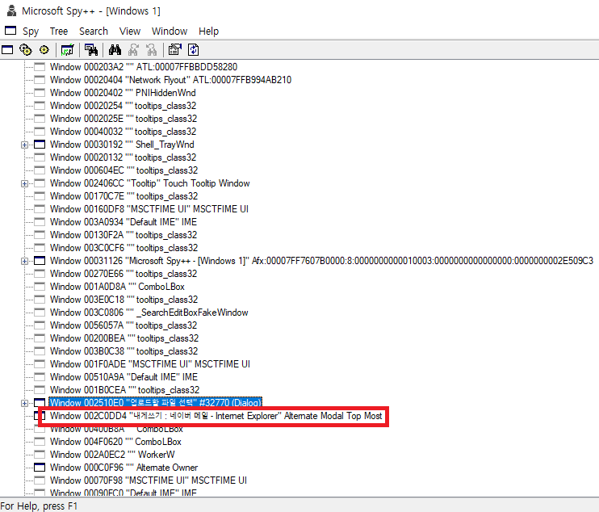
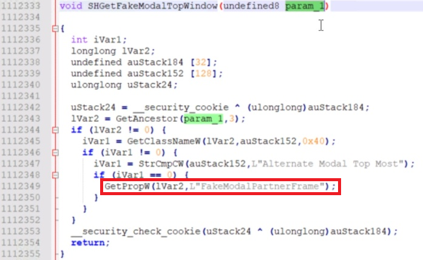

## 1. 증상
- 관리자 권한으로 실행된 Internet Explorer 에서는 Url 을 확인할 수 없음
- 내부로직에서 Owner Window 를 확인할 수 없음
- Spy++ 확인결과, 관리자 권한 실행시 Dialog 를 포함하는 Tree 밖에 Owner 가 있음 **(Alternate Modal Top Most)**

## 2. 해결 방안
- Ghidra (https://github.com/nationalsecurityagency/ghidra) 를 사용하여 IEFrame.dll 모듈을 리버싱한 소스에서 아래와 같은 코드를 확인함

- GetProp (https://docs.microsoft.com/en-us/windows/win32/api/winuser/nf-winuser-getpropa)
- 위 코드와 같이 GetProp 의 Return 값을 HWND 로 Casting 하여 확인한 결과, Tree 외부의 Owner 임을 확인

## 3. 결과
