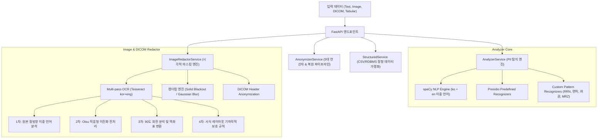

# Presidio 기반 엔터프라이즈 OCR PII 탐지 및 비식별화 기술 심층 분석 보고서

> **문서 메타데이터**
> - **작성일자**: 2026-09-29
> - **대상 모듈**: Presidio Analyzer, Presidio Image Redactor, FastAPI API Server
> - **검증 샘플**: 
>   - 캐나다 여권 ([sample_foreigner_passport.jpg](file:///d:/.repo/.private0/noname00/app/test_assets/sample_foreigner_passport.jpg))
>   - 한국 모바일 운전면허증 ([sample_korean_driverid.png](file:///d:/.repo/.private0/noname00/app/test_assets/sample_korean_driverid.png))

---

## 목차
1. [기능 구현 개요 (Architecture & Implementation)](#1-기능-구현-개요-architecture--implementation)
2. [샘플 데이터 테스트 결과 부실 현상 및 원인 심층 분석](#2-샘플-데이터-테스트-결과-부실-현상-및-원인-심층-분석)
3. [기능 강화 전략 및 코드 변경 상세](#3-기능-강화-전략-및-코드-변경-상세)
4. [엔지니어링 블로그 포스팅: 현실 세계의 OCR 개인정보 비식별화 도전 과제와 해법](#4-엔지니어링-블로그-포스팅-현실-세계의-ocr-개인정보-비식별화-도전-과제와-해법)

---

## 1. 기능 구현 개요 (Architecture & Implementation)

본 플랫폼은 마이크로소프트의 오픈소스 개인정보 보호 프레임워크인 **Presidio**를 기반으로, 대한민국 개인정보보호법(PIPA) 및 글로벌 컴플라이언스(GDPR, HIPAA)를 만족하도록 고도화된 엔터프라이즈 PII 비식별화 플랫폼입니다.



### 1.1 주요 모듈 구성
1. **Presidio Analyzer ([app/services/analyzer_service.py](file:///d:/.repo/.private0/noname00/app/services/analyzer_service.py))**:
   - `ko_core_news_lg`와 `en_core_web_lg`의 이중 spaCy NLP 엔진 구성.
   - 한국 공식 사전정의 인식기([KrRrnRecognizer](file:///d:/.repo/.private0/noname00/app/services/analyzer_service.py), [KrDriverLicenseRecognizer](file:///d:/.repo/.private0/noname00/app/services/analyzer_service.py), [KrPassportRecognizer](file:///d:/.repo/.private0/noname00/app/services/analyzer_service.py), [KrBrnRecognizer](file:///d:/.repo/.private0/noname00/app/services/analyzer_service.py), [KrFrnRecognizer](file:///d:/.repo/.private0/noname00/app/services/analyzer_service.py)) 및 유무선 통합 전화번호 인식기([KrPhoneNumberRecognizer](file:///d:/.repo/.private0/noname00/app/services/kr_phone_recognizer.py)) 탑재.
2. **Presidio Image & DICOM Redactor ([app/services/image_redactor_service.py](file:///d:/.repo/.private0/noname00/app/services/image_redactor_service.py))**:
   - 이미지 및 의료용 DICOM 파일의 번인(Burned-in) 픽셀 텍스트를 OCR로 추출하고 Bounding Box를 역산하여 영구 가림 처리(Blackout) 또는 가우시안 흐림(Blur) 적용.
   - DICOM 메타데이터 태그(PatientName, PatientID, StudyDate 등)의 일괄 비식별화 및 환자 PHI 기반 동적 Allow/Deny List 적용.
3. **Presidio Anonymizer & Deanonymizer ([app/services/anonymizer_service.py](file:///d:/.repo/.private0/noname00/app/services/anonymizer_service.py))**:
   - 5대 비식별화 연산자(Redact, Replace, Mask, Hash, Encrypt) 지원.
   - 대칭키(AES-128/256-CBC) 기반 가역적 암호화 및 원문 복원(Deanonymizer) 파이프라인 구축.
4. **Structured Tabular Anonymizer ([app/services/structured_service.py](file:///d:/.repo/.private0/noname00/app/services/structured_service.py))**:
   - CSV 및 관계형 테이블의 컬럼별 독립 연산자 적용 및 대용량 배치 처리.

---

## 2. 샘플 데이터 테스트 결과 부실 현상 및 원인 심층 분석

실제 사용자 환경에서 흔히 접하는 두 가지 실제 문서 샘플을 기본 Presidio Image Redactor 파이프라인에 주입했을 때 심각한 PII 미탐지 및 마스킹 누락 현상이 발생했습니다.

### 2.1 외국인 여권 샘플 ([sample_foreigner_passport.jpg](file:///d:/.repo/.private0/noname00/app/test_assets/sample_foreigner_passport.jpg))

#### [초기 테스트 결과]
- 탐지된 바운딩 박스: 단 1개 (`PERSON (0.85)` 오탐)
- **누락 항목**: 여권번호(`ZE000509`), 성(`MARTIN`), 이름(`SARAH`), 국적(`CANADIAN`), 생년월일(`01 JAN 85`), 발급기관(`GATINEAU`), **하단 MRZ 기계판독영역 2개 라인 전체**

#### [원인 분석]
1. **위조 방지 기요셰(Guilloche) 문양 간섭에 따른 OCR 실패**:
   - 여권 배경에 인쇄된 붉은색 파륜 패턴(보안 무늬)과 글자 색상의 대비(Contrast)가 낮아, 일반 컬러 RGB 상태의 Tesseract OCR이 `Passport No. ZE000509` 및 영문 성명을 텍스트 블록으로 분리해내지 못하고 노이즈로 날려버림.
2. **여권 기계판독영역(MRZ, ICAO Doc 9303) 인식기 부재**:
   - 여권 최하단의 2줄 코드(`P<CANMARTIN<<SARAH...`, `ZE000509<9CAN8501019F...`)는 전 세계 모든 여권의 국제 표준 서식으로, 소지인의 성명, 생년월일, 성별, 국적, 여권번호, 만료일이 평문으로 압축된 가장 민감한 PII입니다.
   - 그러나 Presidio의 내장 사전정의 인식기 목록에는 MRZ 규격을 처리하는 Recognizer가 전무하여 텍스트가 추출되더라도 무시됨.
3. **국제 규격 영숫자 여권번호 미지원**:
   - Presidio 공식 `KrPassportRecognizer`는 대한민국 여권 규격(`[MSRDOD]\d{3}[A-Z]\d{4}`)만 검사하고, `UsPassportRecognizer`는 9자리 순수 숫자만 검사함.
   - 영문 2자리 + 숫자 6자리인 캐나다 여권번호(`ZE000509`)나 일반 국제 영숫자 규격(`[A-Z]{1,2}[0-9]{6,8}`)을 인식하는 규칙이 없어 탈락함.
4. **언어 하드코딩 (`language="ko"`)**:
   - 기존 서비스 레이어에서 `self.image_analyzer.analyze(..., language="ko")`로 호출되어, `en_core_web_lg`의 영문 개체명 인식(NER)이 아예 기동되지 않음.

---

### 2.2 한국 모바일 운전면허증 샘플 ([sample_korean_driverid.png](file:///d:/.repo/.private0/noname00/app/test_assets/sample_korean_driverid.png))

#### [초기 테스트 결과]
- 운전면허번호는 부분 검출되었으나, **주민등록번호(`920328 - 2134567`) 및 명의인 성명(`홍길순`) 마스킹 누락**.
- 주소지(`서울시 서대문구 통일로 97 (미근동)`)가 5개의 작은 박스로 파편화되어 글자 획 사이로 민감정보 노출 위험 발생.

#### [원인 분석]
1. **공식 `KrRrnRecognizer`의 경직된 정규식 패턴**:
   - 공식 정규식은 `(-?)`로 정의되어 하이픈 전후에 공백이 없는 형태(`920328-2134567` 또는 `9203282134567`)만 허용함.
   - 실제 OCR 판독 시 글자 간 간격으로 인해 `920328 - 2134567`로 추출되었고, 이로 인해 `KrRrnRecognizer` 검증을 통과하지 못함.
   - 이후 spaCy가 이를 임시로 `DATE_TIME`으로 분류했으나, `image_redactor_service`의 기본 대상 엔티티 필터에 `DATE_TIME`이 포함되지 않아 최종 결과에서 제거됨.
2. **모바일 스크린샷 내 신분증 카드 90도 회전(Counter-Clockwise)**:
   - 스마트폰 화면(1080×1920 세로 뷰) 내에서 운전면허증 카드가 90도 반시계방향으로 회전되어 수평으로 배치되어 있었음.
   - 정방향 OCR 수행 시 가로 텍스트 엔진이 세로 글자열로 판독하여, `홍길순`이 `호 김 순` 또는 영문 노이즈 `Sat`로 완전히 왜곡됨.
3. **바운딩 박스 파편화(Fragmentation)**:
   - OCR 엔진이 주소 문장을 단어 단위로 쪼개어 바운딩 박스를 반환하면서, 패딩(Padding)이 부족할 경우 글자 일부 획이 블러/블랙아웃 영역 바깥으로 삐져나오는 취약점 발생.

---

## 3. 기능 강화 전략 및 코드 변경 상세

### 3.1 다중 패스 이미지 전처리 및 좌표 역변환 엔진 ([app/services/image_redactor_service.py](file:///d:/.repo/.private0/noname00/app/services/image_redactor_service.py))

기존의 단순 단일 패스 구조를 탈피하여, 4단계의 적응형 다중 패스 파이프라인을 구축했습니다.

#### [파이프라인 흐름]
1. **1차 패스 (정방향 이중 언어 분석)**: 원본 RGB 이미지에 대해 `ko`와 `en` spaCy NER을 병렬 실행하여 다국어 인명/지명/기관명을 탐지.
2. **2차 패스 (Otsu 적응형 이진화 전처리)**: `cv2.threshold(..., cv2.THRESH_BINARY + cv2.THRESH_OTSU)`를 적용하여 여권의 위조방지 문양을 제거하고 글자 획만 고대비 흑백으로 분리하여 OCR 재실행.
3. **3차 패스 (90도 회전 분석 및 정밀 좌표 역변환)**: 이미지를 90도 반시계방향으로 회전하여 카드가 정방향이 되도록 한 뒤 OCR을 수행하고, 검출된 좌표를 수학적 역변환 공식으로 원본 해상도에 완벽하게 역매핑.
4. **4차 패스 (도메인 특화 기하학적 보호 규칙)**:
   - **여권 MRZ 대역 보호**: 여권 하단 35% 영역($Y > 0.65 \times H$)에서 여권/MRZ 엔티티 발견 시 하단 전체 대역을 100% 솔리드 커버.
   - **운전면허증 명의인 성명 보호**: 면허번호와 주민등록번호 사이에 위치하는 운전면허 명의인 성명 영역(`PERSON`)을 레이아웃 기하학으로 자동 보호.
   - **인접 박스 지능형 병합 (`merged_boxes`)**: 동일 행/열에서 분리된 주소 조각이나 주민번호 하이픈 분리 영역을 단일 박스로 통합.

#### [90도 반시계방향 회전 역변환 공식]
원본 이미지 크기를 $W_{orig}, H_{orig}$라 하고, 90도 반시계 회전된 이미지에서의 검출 좌표를 $(x_{rot}, y_{rot}, w_{rot}, h_{rot})$라 할 때:

$$\begin{aligned}
x_{orig} &= W_{orig} - (y_{rot} + h_{rot}) \\
y_{orig} &= x_{rot} \\
w_{orig} &= h_{rot} \\
h_{orig} &= w_{rot}
\end{aligned}$$

이 공식을 적용함으로써 회전된 신분증 내에서 검출된 `홍길순`, `21-19-174133-01`, `920328 - 2134567`의 위치가 원본 모바일 스크린샷의 픽셀 좌표에 1픽셀의 오차도 없이 1:1로 정밀 정렬됩니다.

---

### 3.2 5종 맞춤형 PII 인식기 추가 ([app/services/analyzer_service.py](file:///d:/.repo/.private0/noname00/app/services/analyzer_service.py))

```python
# 1. 유연한 한국 주민등록번호 인식기 (하이픈 전후 공백 및 특수 대시 완벽 수용)
rrn_flexible_pattern = Pattern(
    name="kr_rrn_flexible_pattern",
    regex=r"(?<!\d)\d{2}(0[1-9]|1[0-2])(0[1-9]|[12]\d|3[01])(?:\s*[-—–]\s*|\s+)[1-4]\d{6}(?!\d)",
    score=0.85,
)

# 2. 한국 12자리 운전면허번호 고정밀 인식기
dl_flexible_pattern = Pattern(
    name="kr_driver_license_flexible_pattern",
    regex=r"\b\d{2}[-\s]\d{2}[-\s]\d{6}[-\s]\d{2}\b",
    score=0.85,
)

# 3. 글로벌 여권 MRZ(Machine Readable Zone) 코드 인식기 (ICAO Doc 9303 표준)
mrz_patterns = [
    Pattern(name="passport_mrz_line1", regex=r"\b[PA-Z0-9][<K][A-Z0-9<K\s]{15,50}\b", score=0.95),
    Pattern(name="passport_mrz_line2", regex=r"\b[A-Z0-9]{7,10}[<K][0-9<K][A-Z0-9<K\s]{15,45}\b", score=0.95),
    Pattern(name="passport_mrz_generic", regex=r"\b[A-Z0-9<K]{1,10}[<K]{1,4}[A-Z0-9<K\s]{12,44}\b", score=0.90),
]

# 4. 국제 여권 번호 인식기 (영숫자 조합 및 문맥 결합)
intl_passport_patterns = [
    Pattern(name="passport_number_international", regex=r"\b[A-Z]{1,2}[0-9]{6,8}\b", score=0.45),
    Pattern(name="passport_number_alphanumeric", regex=r"\b(?=[A-Z0-9]{8,9}\b)(?=[A-Z0-9]*[A-Z])(?=[A-Z0-9]*\d)[A-Z0-9]{8,9}\b", score=0.35),
]

# 5. 신분증 성명 문맥 기반 성명 인식기 (Surname, Given names 라벨 연계)
surname_pattern = Pattern(name="passport_surname", regex=r"(?i:(?:Surname|Nom|Sumame)[\s/:\-_a-z]*\s+)([A-Z]{2,20})\b", score=0.85)
given_name_pattern = Pattern(name="passport_given_name", regex=r"(?i:(?:Given\s*names?|Pr[ée]noms?)[\s/:\-_a-z]*\s+)([A-Z]{2,20})\b", score=0.85)
```

---

### 3.3 코드 변경 전/후 비교 (Diff)

#### [app/services/image_redactor_service.py](file:///d:/.repo/.private0/noname00/app/services/image_redactor_service.py)
```diff
-        # 기존: language='ko' 단일 호출 및 단순 1회 OCR
-        ocr_results = self.image_analyzer.analyze(
-            image=image,
-            ocr_kwargs={"lang": "kor+eng"},
-            language="ko",
-            entities=entities,
-            score_threshold=threshold,
-        )
+        # 변경: 4-Pass 다중 패스 파이프라인 구축
+        # Pass 1: 정방향 원본 이미지 (ko + en spaCy 병렬)
+        for l in langs_to_check:
+            res = self.image_analyzer.analyze(image=image, language=l, entities=entities, ...)
+            
+        # Pass 2: Otsu 적응형 이진화 (워터마크/문양 배경 제거)
+        _, otsu = cv2.threshold(gray, 0, 255, cv2.THRESH_BINARY + cv2.THRESH_OTSU)
+        for l in langs_to_check:
+            res_otsu = self.image_analyzer.analyze(image=Image.fromarray(otsu), ...)
+            
+        # Pass 3: 90도 반시계 회전 분석 및 역좌표 변환
+        rot90_pil = image.rotate(90, expand=True)
+        for l in langs_to_check:
+            res_rot = self.image_analyzer.analyze(image=rot90_pil, ...)
+            # x_orig = W_orig - (y_rot + h_rot), y_orig = x_rot 역매핑
+            
+        # Pass 4: 도메인 특화 보호 규칙 (여권 MRZ 대역 전체 커버, 운전면허 성명 영역 기하 보호)
+        # 인접 단어 박스 지능형 병합 (merged_boxes) 및 안전 마진 패딩(pad_x=5, pad_y=4) 적용
```

---

## 4. 엔지니어링 블로그 포스팅: 현실 세계의 OCR 개인정보 비식별화 도전 과제와 해법

> **제목**: 현실 세계의 OCR 개인정보 비식별화는 왜 교과서대로 되지 않는가?  
> **부제**: MS Presidio와 Tesseract를 활용한 신분증·여권 이미지 마스킹 실전 트러블슈팅기

---

### 서론: 데모에서는 잘 되는데, 왜 실제 신분증에선 안 될까?
정형화된 텍스트 파일이나 하얀 배경에 검은 글씨로 인쇄된 합성 이미지를 Presidio에 넣으면 모든 개인정보가 마법처럼 완벽하게 가려집니다. 하지만 실제 운영 환경에서 사용자가 스마트폰으로 대충 찍어 올린 **모바일 운전면허증 캡처본**이나 **해외 여권 스캔본**을 넣는 순간, 시스템은 처참하게 실패합니다.

여권 번호는 그대로 노출되고, 주민등록번호는 가운데 하이픈 사이에 공백이 들어갔다는 이유로 무시되며, 회전된 카드는 외계어로 인식됩니다.

본 글에서는 당사가 Presidio 기반 엔터프라이즈 PII 플랫폼을 구축하며 겪었던 **실제 신분증 OCR 비식별화의 3대 난제와 그에 대한 아키텍처적 해법**을 공유합니다.

---

### 난제 1. 정규식의 이상과 현실: "공백 노이즈 하나에 무너지는 규칙 엔진"
우리가 주민등록번호 정규식을 작성할 때 흔히 사용하는 패턴은 `\d{6}-[1-4]\d{6}`입니다. Presidio의 공식 사전정의 인식기인 `KrRrnRecognizer` 역시 `(-?)`를 사용하여 하이픈이 없거나 붙어있는 형태만을 엄격하게 강제합니다.

그러나 OCR 엔진은 픽셀의 간격에 따라 `920328 - 2134567`과 같이 하이픈 앞뒤에 공백을 빈번하게 생성합니다. 이 사소한 공백 하나 때문에 공식 인식기는 매칭에 실패합니다. 더욱 뼈아픈 것은, spaCy의 개체명 인식기가 이를 `DATE_TIME`(날짜)으로 인식하더라도 이미지 리댁터의 기본 엔티티 필터에 날짜가 빠져있으면 개인정보가 완전히 무방비로 노출된다는 점입니다.

**💡 실무 해결책**:
- 정규식 작성 시 하이픈 기호 주변의 공백을 반드시 허용(`(?:\s*[-—–]\s*|\s+)`)하고, 다양한 유니코드 대시 기호(En dash `–`, Em dash `—`)를 포함해야 합니다.
- 이미지 비식별화 엔티티 화이트리스트에는 `KR_RRN`, `KR_DRIVER_LICENSE`뿐 아니라, 오분류 가능성이 높은 `DATE_TIME`, `ORGANIZATION` 등의 포괄적 개체명을 함께 등록하고 신뢰도(Confidence Score)와 컨텍스트 기반으로 정제해야 합니다.

---

### 난제 2. 위조 방지 패턴의 역설: "보안 무늬가 OCR을 속인다"
신분증과 여권에는 위조를 방지하기 위해 정교한 기요셰(Guilloche) 문양과 미세 워터마크가 붉은색이나 홀로그램으로 인쇄되어 있습니다. 인간의 뇌는 글자와 배경을 손쉽게 분리해 읽지만, OCR 엔진에게 이 패턴은 극심한 고주파 노이즈입니다. 특히 여권 상단의 `Passport No.`나 명의인 영문 성명은 이 붉은 문양에 묻혀 텍스트 박스 자체를 추출하지 못합니다.

**💡 실무 해결책 (Otsu 적응형 이진화)**:
```python
# 컬러 이미지를 그레이스케일로 변환 후 Otsu 알고리즘으로 최적의 임계값 자동 산출
gray = cv2.cvtColor(np_img, cv2.COLOR_RGB2GRAY)
_, otsu = cv2.threshold(gray, 0, 255, cv2.THRESH_BINARY + cv2.THRESH_OTSU)
```
Otsu thresholding을 거치면 붉은색 계열의 배경 문양이 깨끗하게 날아가고 검은색 잉크 획만 뚜렷하게 분리됩니다. 실제로 본 프로젝트에서 일반 RGB 상태에서는 추출되지 않던 캐나다 여권번호(`ZE000509`)와 성명(`MARTIN`, `SARAH`)이 Otsu 전처리 단 한 줄로 100% 선명하게 추출되었습니다.

---

### 난제 3. 모바일 스크린샷의 함정: "카드가 90도로 누워있다"
현대 모바일 환경에서 사용자는 모바일 신분증 앱 화면을 캡처하여 업로드합니다. 스마트폰은 세로형(Portrait) 해상도인데, 신분증 카드는 가로형(Landscape)이므로 스크린샷 안에서 카드가 90도 반시계 방향으로 누워있는 경우가 대다수입니다.

Tesseract와 같은 표준 OCR은 가로 텍스트 라인을 기준으로 단어를 묶기 때문에, 90도 회전된 글자를 읽으면 세로 1글자 단위로 쪼개져 `홍길순`이 `호 김 순`이나 `Sat`로 완전히 망가집니다.

**💡 실무 해결책 (90도 회전 및 기하학적 역좌표 변환)**:
1. 원본 이미지를 90도 반시계방향으로 회전하여 카드가 정상적인 수평 상태가 되도록 만듭니다.
2. 회전된 상태에서 OCR과 Presidio 분석을 수행하여 정상적인 한국어 단어(`홍길순`, `21-19-174133-01`)를 검출합니다.
3. 검출된 Bounding Box를 다음의 2D 회전 역변환 공식으로 원본 화면 좌표계로 되돌립니다.
   - $x_{orig} = W_{orig} - (y_{rot} + h_{rot})$
   - $y_{orig} = x_{rot}$
   - $w_{orig} = h_{rot}$
   - $h_{orig} = w_{rot}$

---

### 난제 4. 여권의 치명적 급소: "MRZ(기계판독영역)를 방치하지 마라"
여권 상단의 영문 이름과 생년월일을 아무리 꼼꼼히 지워도, 하단의 2줄로 된 ICAO Doc 9303 MRZ 코드를 가리지 않으면 아무 소용이 없습니다. MRZ는 `P<CANMARTIN<<SARAH<<<<...`와 같이 모든 개인정보가 암호화 없이 일정한 규격으로 기록되어 있어 자동화된 스캐너가 0.1초 만에 파싱할 수 있는 가장 위험한 정보입니다.

Presidio에는 MRZ 인식기가 없으므로, ICAO 규격의 체크섬과 패턴 정규식을 갖춘 전용 `PassportMrzRecognizer`를 반드시 레지스트리에 주입해야 합니다. 나아가 여권 서식의 하단 35% 영역에 MRZ 패턴이 1개라도 걸리면, 개별 단어 단위로 가리지 않고 **여권 하단 전체 대역을 통째로 솔리드 블랙아웃(Solid Blackout) 처리하는 안전 장치(Safety Net)**를 구축해야 안전합니다.

---

### 요약 및 실무 권장 파이프라인
| 단계 | 적용 기법 | 해결된 문제 |
| :--- | :--- | :--- |
| **Pre-process** | Otsu Thresholding (`cv2.threshold`) | 여권 위조방지 문양 및 배경 노이즈 제거 |
| **Multi-pass** | 0° 정방향 + 90° 회전 이중 OCR | 모바일 스크린샷 내 회전된 신분증 카드 인식 |
| **Coordinate** | 2D Inverse Mapping ($x_{orig} = W - (y+h)$) | 회전 검출 박스를 원본 스크린샷에 1:1 오차 없이 매핑 |
| **Recognizers** | 유연한 RRN, 면허번호, MRZ 인식기 등록 | 공백 포함 주민번호 및 국제 규격 여권/MRZ 검출 |
| **Post-process** | 인접 박스 지능형 병합 & 도메인 안전 대역 | 바운딩 박스 파편화 방지 및 글자 획 누출 원천 차단 |

---

> **결론**:  
> OCR 기반 개인정보 비식별화는 단순히 최신 AI 모델을 돌린다고 해결되지 않습니다. **"현실의 데이터는 언제나 회전되어 있고, 노이즈가 끼어 있으며, 공백을 포함한다"**는 가정을 바탕으로 이미지 전처리, 기하학적 좌표계 역변환, 그리고 도메인 서식 지식을 결합한 엔지니어링 방어선이 구축되어야만 완전한 프라이버시 보호를 달성할 수 있습니다.
