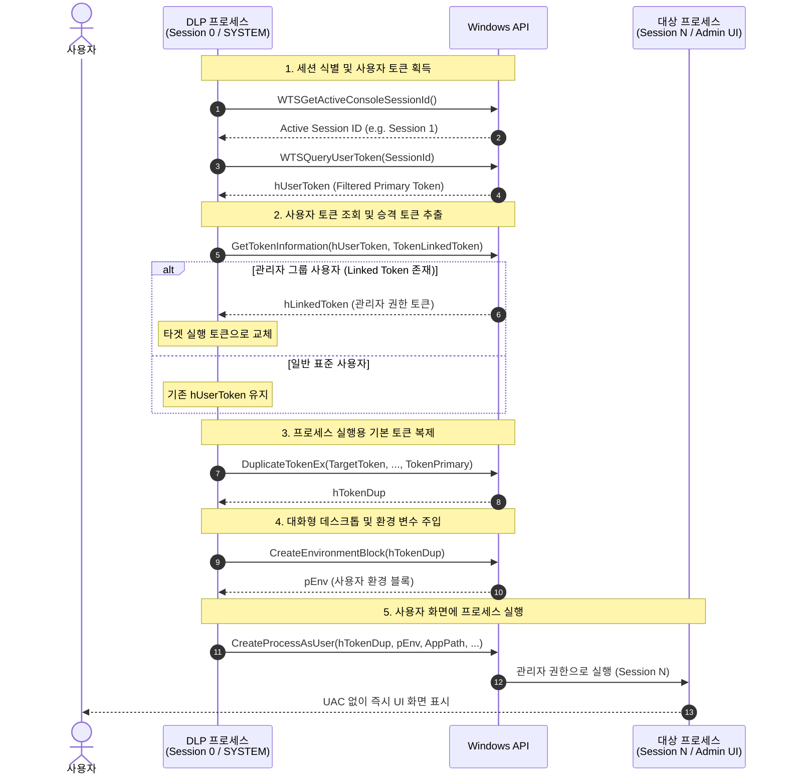

## Session 0 과 UAC 라는 벽
DLP 솔루션을 개발하다 보면 보안 기능을 활성화를 위해 Windows 서비스를 반드시 필요로 한다. 또, 사용자 화면에는 트레이 아이콘이나 알림창, 설정 UI 같은 데스크톱 프로세스를 띄워야 하는 구조를 자주 마주친다. 보통은 서비스에서 자식 프로세스를 띄우면 그만일 것 같지만, 실제로는 두가지 벽에 부딪힌다.

1. Session 0 격리 : 서비스는 사용자가 보이지 않는 세션(Session 0)에서 격리되어 실행된다. 서비스에서 단순히 `CreateProcess`를 호출하면 사용자 화면에는 아무것도 뜨지 않는 투명 프로세스가 된다.
2. UAC(User Account Control) 팝업 : 보안 정책상 클라이언트 프로세스가 관리자 권한을 필요로 할 때 일반적인 방법으로 실행하면 매번 윈도우 화면이 어두워지며 UAC 승인 창이 뜬다.

사용자 경험을 크게 해치는 이 문제를 해결하려면, 백그라운드 서비스의 막강한 권한을 활용해 사용자 화면에 UAC 팝업 없이 관리자 권한으로 직접 프로세스 실행이 필요했다.
 
 

## Windows 토큰과 세션의 구조
해결책을 찾기 위해 파고든 핵심은 Windows의 액세스 토큰(Access Token) 구조다.

- 분할 토큰 (Split-Token) : UAC 환경에서 관리자 계정으로 로그인한 사용자는 기본적으로 권한이 제한된 표준 토큰(Filtered Token)을 받고, 관리자 권한을 가진 승격 토큰(Linked Token)은 뒤에 숨겨져 연결되어 있다.
- TokenPrimary vs Impersonation: 스레드가 다른 계정 행세를 할 때는 가장 토큰(Impersonation Token)으로 충분하지만, 새 프로세스를 실행하려면 반드시 기본 토큰(TokenPrimary) 형태여야 한다.

구현 방향은 이랬다.
1. 서비스가 활성 세션의 사용자 토큰을 가져와 숨겨진 승격 토큰(Linked Token)을 찾고, 
2. 이를 Primary 토큰으로 복제하여 
3. 대화형 화면(winsta0\default)에 프로세스를 던져주는 것이다.
 
 

### 핵심 동작 파이프라인

### 1. 세션 식별 및 사용자 토큰 획득
- [WTSGetActiveConsoleSessionId](https://learn.microsoft.com/ko-kr/windows/win32/api/winbase/nf-winbase-wtsgetactiveconsolesessionid)
- 현재 로그온 사용자의 세션 ID 를 확인
- 원격 데스크톱(RDP) 환경이라면 WTSEnumerateSessions를 통해 대상 세션 ID 를 확인

### 2. 사용자 토큰 조회 및 승격 토큰 추출
- [WTSQueryUserToken](https://learn.microsoft.com/ko-kr/windows/win32/api/wtsapi32/nf-wtsapi32-wtsqueryusertoken)
- [GetTokenInformation](https://learn.microsoft.com/ko-kr/windows/win32/api/securitybaseapi/nf-securitybaseapi-gettokeninformation)
- 세션 ID 로 로그인된 사용자의 기본 토큰(hUserToken)을 추출
- GetTokenInformation 에 `TokenLinkedToken` flags 를 넘겨, UAC 로 숨겨져 있던 승격된 관리자 토큰(Linked Token)을 추출

### 3. 프로세스 실행용 기본 토큰 복제
- [DuplicateTokenEx](https://learn.microsoft.com/ko-kr/windows/win32/api/securitybaseapi/nf-securitybaseapi-duplicatetokenex)
- 추출한 승격 토큰은 그대로 프로세스 생성 API 에 넣을 수 없는 경우가 많다
- DuplicateTokenEx 를 호출하여 실행 속성인 `TokenPrimary` 타입으로 새 토큰 핸들을 복제

### 4. 대화형 데스크톱 및 환경 변수 주입
- [CreateEnvironmentBlock](https://learn.microsoft.com/ko-kr/windows/win32/api/userenv/nf-userenv-createenvironmentblock)
- 사용자의 프로필 환경 변수(PATH, USERPROFILE 등)를 그대로 복제
- `STARTUPINFO.lpDesktop` 에 대화형 윈도우 스테이션인 `winsta0\\default` 를 명시하여 `Session 0` 이 아닌 사용자 모니터 화면으로 창이 뜨도록 지정

### 5. 사용자 화면에 프로세스 실행
- [CreateProcessAsUser](https://learn.microsoft.com/ko-kr/windows/win32/api/processthreadsapi/nf-processthreadsapi-createprocessasusera)
- 복제한 승격 토큰, 환경 블록, 대화형 데스크톱 설정을 넘겨 프로세스를 실행
 
 

## 정리
- 백그라운드 서비스에서 사용자 화면으로 UI 프로세스를 띄울 때 생기는 문제가 해결됬다
- 사용자는 불필요한 UAC 승인 팝업에 시달리지 않고도, 에이전트의 안내 팝업이나 환경설정 창을 제공받게 되었다
- 이후 서비스와 UI 프로세스 간의 실시간 제어는 Named Pipe IPC 통신을 통해 연결했다
