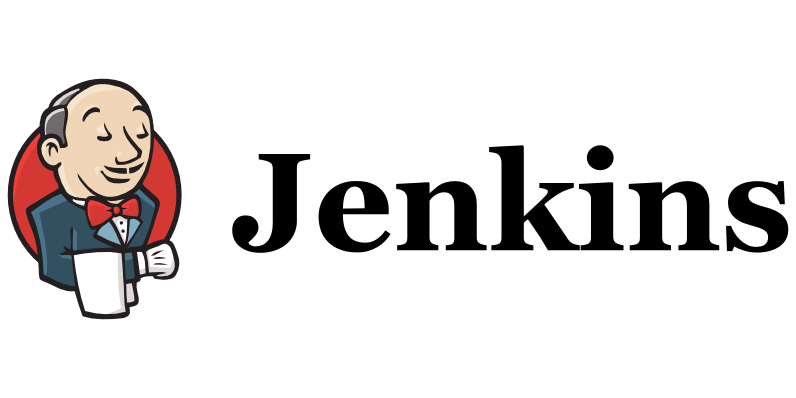
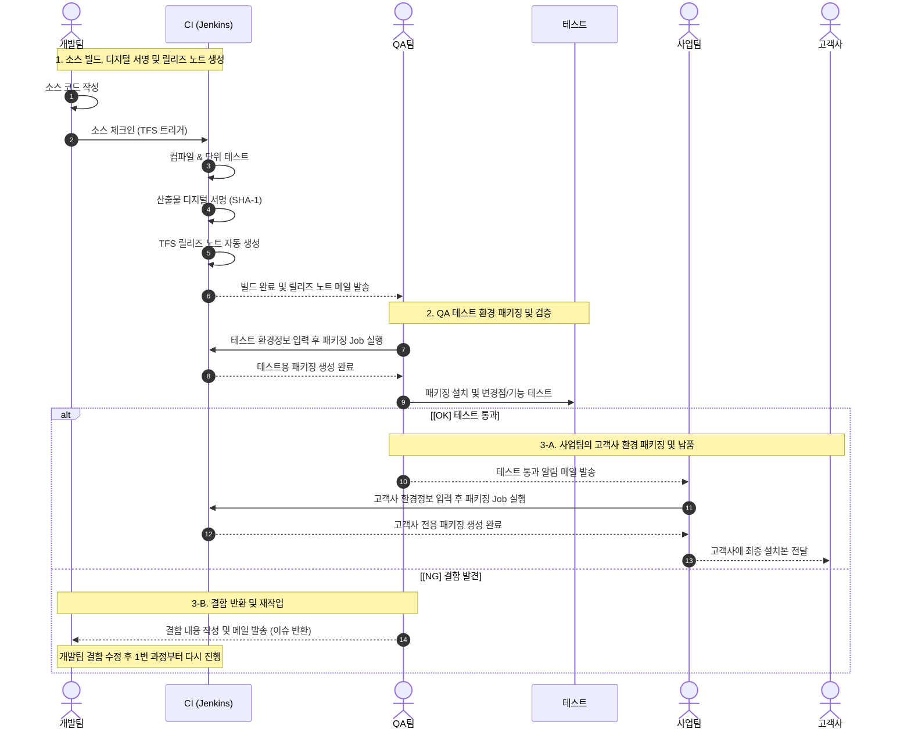

## 반복 노동
엔터프라이즈 DLP 를 개발·운영하다보면 가장 많은 요청 중 하나가 고객사 맞춤형 설치 패키지 생성이다. 당연히 환경설정은 고객마다 제각각이다. 자동화 이전에는 사업팀이나 QA팀의 요청이 들어올 때마다 다음과 같이 작업해왔다.

1. 개발자가 소스코드를 빌드
2. 생성된 산출물과 요청받은 고객사 환경정보를 설정 파일에 작성
4. 패키징 도구로 인스톨러(.exe / .msi) 패키지 생성
5. 디지털 서명한 뒤, 산출물을 공유 폴더와 메일로 전달

하루에도 수차례 들어오는 이 요청은 내 개발 흐름을 끊었다. "단순 설정값 몇 개 바꾸고 패키징 찍어내는 일을 왜 매번 수동으로 처리해야 하지" 라는 귀차니즘이 극에 달했고, 이를 해결하고자 방법을 찾다 `Jenkins` 를 알게 되면서 자동화하기로 마음먹었다.
 
 

## Jenkins란?

Jenkins는 소프트웨어 개발 과정에서 CI(Continuous Integration) 와 CD(Continuous Delivery) 를 자동화해 주는 Java 기반의 오픈소스다.

- 형상 관리 도구(당시 사내에서 사용하던 TFS 등)의 커밋이나 스케줄러를 감지하여 자동으로 컴파일하고 단위 테스트를 수행
- 빌드 실행 시점에 Text, Boolean, File 등을 입력받아 스크립트에 동적으로 전달
- 메일 발송, 빌드 결과 알림 등 지원

특히 이번 작업에서 핵심이 된 기능은 파라미터화 된 빌드였다. 고객사별 환경정보를 웹을 통해 입력받아 빌드 스크립트 내부로 주입할 수 있다면, 내가 직접 하지 않아도 필요한 사람이 직접 패키징을 할 수 있겠다는 생각이 들었다.
 
 

## ACL 설계
자동화를 사내에 배포하기 전에 가장 신경 쓴 부분은 ACL 분리였다. Jenkins 의 `Role-based Authorization` 플러그인을 활용해 역할을 두 단계로 나눴다.

|구분|허용|비고|
|---|---|---|
|개발팀|• 소스 전체 빌드 • 패키징 작업 수정 및 실행 • 배포 파이프라인 관리|소스 컴파일 권한 보유|
|QA팀 / 사업팀|• 패키징 Job 실행(파라미터 입력) • 결과 파일 다운로드|소스 코드 접근 및 빌드 환경 수정 불가|

사업팀과 QA팀에는 소스 빌드 작업을 읽기 전용으로 두고, QA팀에 의해 검증된 최신 산출물을 기반으로 환경정보만 입력받아 패키징하는 작업만 적용했다.
 
 

## 새로운 배포 및 검증 프로세스

### 1. 소스 빌드, 디지털 서명 및 릴리즈 노트 생성 (개발팀 & Jenkins)
- 개발자가 코드를 수정하고 형상관리에 체크인하면, Jenkins 가 이를 감지해 빌드를 시작
- 프로젝트 컴파일하고 단위 테스트를 실행
- 컴파일이 완료된 산출물에 Jenkins 빌드 머신 내부 인증서로 디지털 서명
- 형상관리 작업 항목을 파싱하여 변경 내역이 담긴 릴리즈 노트를 생성하고, QA팀에 알림

### 2. 테스트 환경 패키징 및 검증 (QA팀)
- 완료 알림을 받은 QA팀은 Jenkins 의 패키징 Job 을 진행
- 사내 테스트 환경정보로 패키징
- 서명이 완료된 산출물과 환경정보를 포함한 테스트용 패키징을 생성
- QA팀은 테스트 머신에 설치하고 변경점 테스트를 진행

### 3. 검증 결과에 따른 분기 처리
> [OK] 테스트 통과 시 → 고객사 납품용 패키징 (사업팀)

- QA 검증이 통과되면 사업팀에 알림
- 사업팀 담당자는 고객사의 환경정보를 포함한 패키징을 생성
- 고객사에 전달

> [NG] 결함 발견 시 → 이슈 반환 및 재작업 (개발팀)
- 결함 내용(재현 경로, 로그 파일)을 개발팀에 알림
- 개발팀이 확인하여 소스 코드를 수정하여 다시 체크인하면 1번 단계부터 재시작
 
 

## 정리
- 단순 패키징 요청을 처리하느라 개발 흐름이 끊기는 일이 사라짐
- 일정에 따라 반나절 이상 걸리던 고객사 패키징이, 사업팀이 직접 패키징해 5분 안에 다운로드받는 수준으로 단축됨
- "누가, 언제, 어느 고객사 환경정보로 패키징 했는지" 기록이 남아 이슈 발생 시 추적이 쉬워짐

단순한 도구 도입이었지만, 반복되는 비효율을 해결함으로써 매우 의미있는 경험이었다