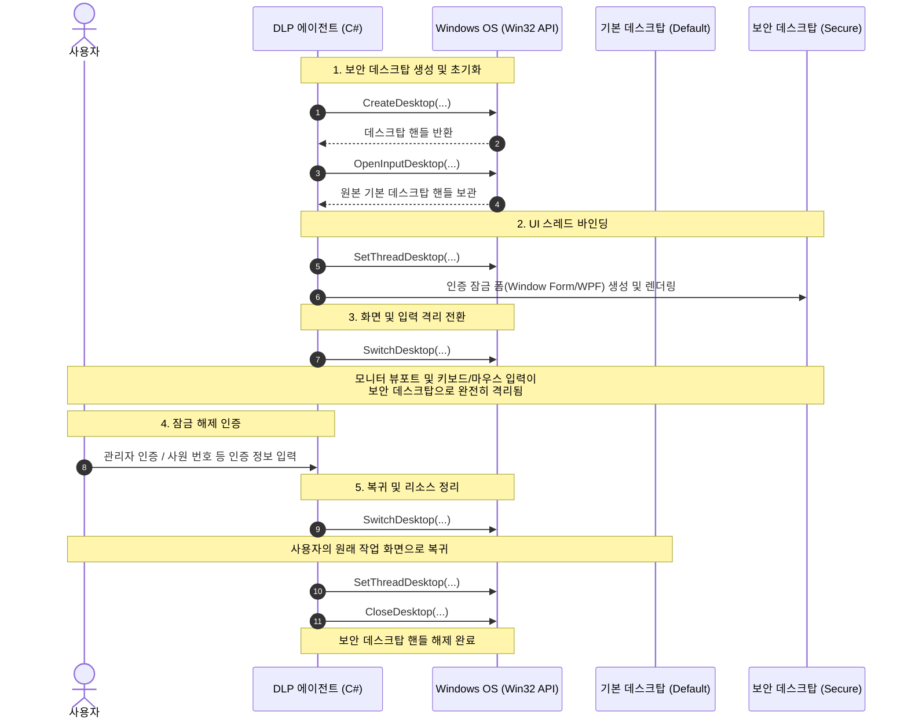

## 기존 화면 잠금 방식의 한계와 새로운 접근

### 1. 왜 TopMost 윈도우로는 부족했을까?
옛날 DLP 솔루션에서는 사용자 인증을 강제하기 위해 단순히 윈도우 창의 `TopMost(Z-Order 최상위)` 속성과 `SetForegroundWindow` API를 주기적으로 호출하는 방식을 사용했다. 하지만 이 방식에는 다음과 같은 치명적인 허점이 있다.

- 사용자가 `Alt + Tab`, `Win + D`, 작업 관리자(`Ctrl + Shift + Esc`) 호출 시 일시적으로 포커스가 빠져나가는 틈새가 발생함
- 악의적인 사용자나 서드파티 프로그램이 해당 잠금 창보다 더 높은 Z-Order 를 강제할 경우 화면 가림이 무력화됨
- 근본적인 문제로 사용자가 일반적인 상호작용을 통해 <span style="color: var(--color-accent-spec);">**"탈출을 시도할 수 있는 환경"**</span> 자체가 열려 있었음
<br>
<br>

### 2. UAC와 Windows 로그온 화면에서 찾은 해답
Windows 의 UAC(사용자 계정 컨트롤) 동의 창이나 로그온 화면은 일반 애플리케이션의 입력을 완벽히 차단하고 백그라운드 화면을 비활성화한다. 이 기능을 분석해보니, Windows 는 창(Window) 단위가 아닌 <span style="color: var(--color-accent-spec);">데스크탑(Desktop) 단위의 세션 격리를 제공</span>한다는 점을 알게됬다. Windows 의 `Interactive Window Station (WinSta0)` 내부에는 `default` 외에도 UAC 가 사용하는 `SecureDesktop`, 로그온 화면이 동작하는 `Winlogon` 데스크탑이 있었다. 동일한 원리로 독립 데스크탑을 새로 생성하여 전환하면, 기존 프로세스의 입력 간섭을 완벽히 차단하는 격리 환경을 만들 수 있었다.
<br>
<br>

## 보안 데스크탑 구현 프로세스



독립 데스크탑을 활용한 잠금 화면은 다음의 4단계 라이프사이클로 동작한다.

### 1. 보안 데스크탑 생성 및 초기화 
- [CreateDesktop](https://learn.microsoft.com/ko-kr/windows/win32/api/winuser/nf-winuser-createdesktopa)
- 격리된 가상 디스플레이 공간 생성

### 2. 스레드 바인딩
- [SetThreadDesktop](https://learn.microsoft.com/ko-kr/windows/win32/api/winuser/nf-winuser-setthreaddesktop)
- 인증 UI를 렌더링할 C# UI 스레드를 생성된 보안 데스크탑에 할당

### 3. 화면 전환
- [SwitchDesktop](https://learn.microsoft.com/ko-kr/windows/win32/api/winuser/nf-winuser-switchdesktop)
- 모니터의 뷰포트와 입력 포커스를 보안 데스크탑으로 전환

### 4. 인증 완료 및 복귀
- [CloseDesktop](https://learn.microsoft.com/ko-kr/windows/win32/api/winuser/nf-winuser-closedesktop)
- 기존 `default` 데스크탑으로 복귀 후 리소스 해제

<br>
<br>

## 프로토타입 개발 중 직면한 이슈와 트러블슈팅

### 1. 부팅 직후 SwitchDesktop 실패 및 타이밍 동기화

PC 부팅 직후 곧바로 SwitchDesktop 을 호출하면 `false` 가 반환되며 화면 전환에 실패하는 현상이 발생함.

- Windows 초기 부팅 시점에는 `Winlogon` 데스크탑이 화면을 점유
- 그래픽 하드웨어 초기화 및 Windows 탐색기(Explorer) Shell 이 완전히 로드되지 않은 상태

SwitchDesktop 은 대상 데스크탑이 속한 Window Station 이 활성 상태가 아니거나, 다른 보안 데스크탑이 잠금을 쥐고 있으면 `ERROR_ACCESS_DENIED` 또는 실패를 반환함을 확인했다. 그래서 폴링(Polling) 루프를 돌되, 무한 루프에 빠지지 않도록 <span style="color: var(--color-accent-spec);">최대 타임아웃 및 지수 백오프/재시도 로직</span>을 추가했다.

```csharp
const int maxRetries = 10;
int retryCount = 0;
int delayMs = 200;              // 초기 대기 시간 (200ms)
const int maxDelayMs = 2000;    // 최대 지연 상한선 (2000ms)
bool isSwitched = false;

while (!isSwitched && retryCount < maxRetries)
{
    isSwitched = User32.SwitchDesktop(_secureDesktop);
    if (!isSwitched)
    {
        int errorCode = Marshal.GetLastWin32Error();
        Logger.Warn($"SwitchDesktop 재시도 대기 ({retryCount + 1}/{maxRetries}): LastError={errorCode}, Delay={delayMs}ms");

        Task.Delay(delayMs).Wait();

        // 대기 시간을 2배씩 증가시키되, 상한선(maxDelayMs)을 넘지 않도록 제한 (지수 백오프)
        delayMs = Math.Min(delayMs * 2, maxDelayMs);
        retryCount++;
    }
}

if (!isSwitched)
{
    // 실패 시 Fallback 로깅 및 예외 처리
    Logger.Error($"SwitchDesktop 전환 실패 (LastError: {Marshal.GetLastWin32Error()})");
}
```
<br>
<br>

### 2. Ctrl+Alt+Del(SAS 화면)을 통한 시스템 탈출 원천 차단

SwitchDesktop 을 통해 독립 화면을 띄워도, Windows 고유 인터럽트인 `Ctrl + Alt + Del (SAS, Secure Attention Sequence)` 키 입력은 커널 수준에서 가로채어 Windows 보안 옵션 화면을 표시한다. 이를 통해 사용자가 작업 관리자를 실행하거나 `로그오프`, `사용자 전환`을 시도할 수 있으므로, <span style="color: var(--color-accent-spec);">잠금 활성화 시점 동안 시스템 정책 레지스트리를 동적으로 제한</span>했다.

- 제어한 레지스트리 값 : REG_DWORD, 0: 허용, 1: 차단/숨김
- HKCU\Software\Microsoft\Windows\CurrentVersion\Policies\System
    - DisableChangePassword: 암호 변경 버튼 비활성화
    - DisableLockWorkstation: 화면 잠금 버튼 비활성화
    - DisableTaskMgr: 작업 관리자 실행 비활성화
    - HideFastUserSwitching: 빠른 사용자 전환 버튼 비활성화
- HKCU\Software\Microsoft\Windows\CurrentVersion\Policies\Explorer
    - NoLogoff: 로그아웃 버튼 비활성화
    - NoClose: 시스템 종료/다시 시작 버튼 비활성화
- HKLM\Software\Policies\Microsoft\Windows\System
    - DontDisplayNetworkSelectionUI: 네트워크 선택(인터넷) UI 비활성화
<br>
<br>

일부 PC 환경에서는 레지스트리 값을 수정하더라도 탐색기 프로세스(Explorer.exe)가 캐싱된 정책을 유지하여 <span style="color: var(--color-accent-spec);">즉시 반영되지 않는 문제</span>가 있었다. 이를 해결하기 위해 시스템 전체 최상위 윈도우에 정책 변경 알림 메시지를 SendMessage 대신 비동기 처리 API 인 [SendNotifyMessage](https://learn.microsoft.com/ko-kr/windows/win32/api/winuser/nf-winuser-sendnotifymessagea) 를 사용하여 정책을 즉각 갱신하도록 처리했다.
<br>
<br>

## 정리
- 단순 최상위 창 덮기 방식에서 벗어나 OS 세션 수준의 격리를 구축함으로써 단축키 우회 시도를 차단.
- `Ctrl + Alt + Del` 의 시스템 인터럽트 메뉴까지 그룹 정책 레지스트리 제어로 비활성화하여 시스템 탈출 시도를 차단.
- OS 부팅 레이스 컨디션을 해결하여 부팅 직후 잠금 환경을 제공.
<br>
<br>
