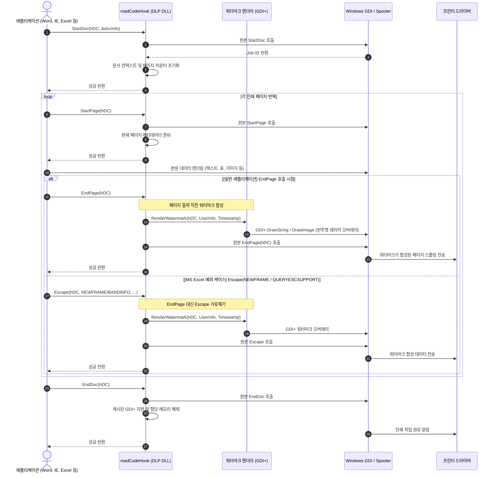

## 종이로 새어나가는 정보, 인쇄 보안의 필요성
엔터프라이즈 환경에서 보안 사고는 네트워크나 USB 뿐만 아니라, `출력물`을 통해서도 빈번히 발생한다. 중요한 계약서나 소스 코드, 고객 개인정보를 출력해 외부로 반출하는 행위를 막아야한다.

- 어떤 프로그램(워드, 웹 브라우저, 메모장, 뷰어 등)에서 인쇄를 누르든,
- 실제 프린터로 전송되는 종이 출력물 중앙과 모서리에 **사번, 사용자 이름, 출력 일시, 기밀 문구**가 포함된 반투명 워터마크를 삽입
 
 

## Windows 인쇄 프로세스와 개입 지점
Windows 프로그램은 프린터 드라이버로 문서를 출력할 때는 Win32 GDI 함수들을 순차적으로 호출한다.

1. `StartDoc` : 인쇄 작업의 시작을 알리고 문서 정보를 설정
2. `StartPage` : 새 페이지 렌더링 준비 및 페이지별 상태 초기화
3. 애플리케이션의 본문 렌더링 (`TextOut`, `BitBlt` 등 본문 내용을 프린터 HDC에 그리기)
4. `EndPage` : 페이지 렌더링 완료를 알리고 프린터 드라이버로 페이지 데이터 전송
5. `EndDoc` : 전체 인쇄 작업 종료

워터마크를 추가하기위해 개입할 곳은 프로그램이 페이지 본문을 다 그린 직후, 프린터 드라이버로 데이터가 넘어가기 직전인 `EndPage` 시점이다. 원본 문서 내용 위에 덮어써야 워터마크가 본문 뒤에 가려지지 않기 때문이다.
 
 

## 인쇄 후킹 및 워터마크 주입 시퀀스
일반적인 문서 도구와 달리, `Microsoft Excel` 은 드라이버 다이렉트 통신 [Escape](https://learn.microsoft.com/ko-kr/windows/win32/api/wingdi/nf-wingdi-escape) 을 사용하는 예외 케이스가 존재한다. 이 분기점까지 포함한 전체 동작 파이프라인은 다음과 같다.

 
 

## 구현 상세
### 1. 페이지 초기화
- 인쇄 작업이 시작되면 출력 대상 문서명과 대상 프린터 정보를 확인하고, 내부적으로 페이지 번호와 작업 컨텍스트를 할당
- 각 페이지의 시작 지점에서 용지 방향(가로/세로) 및 용지 크기를 조회하여 워터마크 크기를 계산

### 2. GDI+ 기반 반투명 워터마크 렌더링
- 페이지 본문 렌더링이 끝난 직후 EndPage 에서 프린터의 HDC를 가로챈다
- 일반 GDI 는 투명도(Alpha Blending) 처리가 까다로워, GDI+ 의 알파 채널 설정을 사용하면 본문 내용을 가리지 않는 비치는 워터마크를 오버레이할 수 있다

### 3. MS Excel의 Escape 함수 예외 처리
- 테스트 도중 Microsoft Excel 에서 워터마크가 찍히지 않는 현상이 확인
- 디버깅을 해보니, 엑셀은 EndPage 루틴을 타지 않고, 레거시 호환성 및 다이렉트 프린터 제어를 위해 Escape API 를 직접 호출해 페이지 넘김을 처리하고 있었다
- 이걸 해결하기 위해 `gdi32.dll` 의 Escape API 까지 추가로 후킹
- `Escape` 의 매개변수가 페이지 종료/전송 관련 메시지인지 확인한 후, 원본 Escape 를 부르기 직전에 동일하게 GDI+ 워터마크 렌더링 루틴을 태워 엑셀 출력물 누락 문제를 해결

### 4. 자원 정리
- 문서 출력이 모두 끝나면 EndDoc 이 호출
- 워터마크 생성을 위해 할당한 자원을 정리하여 메모리 누수를 방지
 
 

## 정리
- 인쇄 파이프라인의 후킹 타이밍: 본문 렌더링 이후이자 드라이버 전송 직전인 EndPage 시점이 워터마크를 오버레이할 수 있는 최적의 인터셉트 포인트였다.
- 예외 처리의 중요성: 모든 애플리케이션이 표준 Win32 인쇄 규격을 곧이곧대로 따르지 않는다. 특히 MS 오피스 제품군(Excel 등)의 레거시 바이패스 방식(Escape)까지 방어 코드로 심어두어야 완벽한 엔터프라이즈 커버리지를 가질 수 있음을 배운 계기였다.
- GDI+의 활용: 인쇄용 프린터 DC 위에서도 알파 블렌딩과 회전 텍스트를 손쉽게 다룰 수 있어 깔끔한 가독성의 워터마크를 구현할 수 있었다.
