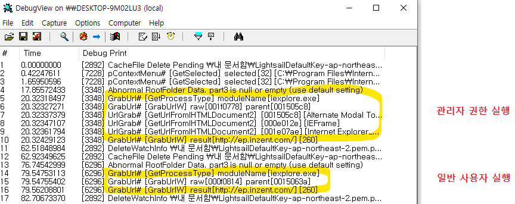

## 일반 사용자는 되는데, 관리자 권한만 안 된다고?
DLP 에이전트의 핵심 기능 중 하나는 사용자가 웹 브라우저를 통해 사내 기밀을 유출하거나 비인가 사이트에 접속하는 것을 감시·차단하는 <span style="color: var(--color-accent-spec);">URL 캡처</span>다. 

Chromium 계열 브라우저의 경우 보통 IAccessible 인터페이스를 통해 윈도우 UI 트리를 순회하며 주소창 컴포넌트를 탐색하지만, Internet Explorer 는 방식이 완전히 다르다.

IE 는 부모 윈도우의 자식 중 `Internet Explorer_Server 클래스` 를 가진 윈도우 핸들을 찾은 뒤, `WM_HTML_GETOBJECT(내부 메시지)` 와 [ObjectFromLresult](https://learn.microsoft.com/ko-kr/windows/win32/api/oleacc/nf-oleacc-objectfromlresult) 를 이용해 `IHTMLDocument2` COM 객체를 직접 획득하여 URL 을 가져오는데, QA 테스트 중 버그가 확인됬다.

- 일반 권한으로 실행한 IE : 아무런 문제 없이 실시간 접속 URL이 정상 캡처
- 관리자 권한으로 실행한 IE : <span style="color: var(--color-accent-spec);">동일한 브라우저임에도 URL 캡처가 누락되며 대상 윈도우 핸들을 추적하지 못함</span>

<br/>
<br/>

## Spy++로 포착한 단서: Alternate Modal Top Most
원인을 파악하기 위해 윈도우 핸들과 스타일을 뜯어볼 수 있는 `Spy++`을 띄웠다.

일반 실행된 IE와 관리자 권한으로 실행된 IE의 윈도우 트리를 나란히 대조하던 중, 관리자 권한 IE의 윈도우 트리에서 매우 낯선 캡션을 발견했다.


동일한 바이너리인데 실행 권한에 따라 윈도우 계층 구조 탐색이 실패한 이유는 내부 핸들 추적 로직에서 윈도우의 `Owner Window`를 올바르게 가져오지 못하고 끊어지는 현상이 원인이었다.

보통 윈도우 트리는 부모-자식 관계로 깔끔하게 묶여 있어야 하는데, 관리자 권한으로 실행된 IE 에서는 일반적인 트리 구조 바깥에 <span style="color: var(--color-accent-spec);">'Alternate Modal Top Most'</span> 라는 생소한 캡션을 가진 독립된 윈도우가 Owner 역할을 가로채고 있었다.

[GetWindow(GW_OWNER)](https://learn.microsoft.com/ko-kr/windows/win32/api/winuser/nf-winuser-getwindow) 로는 이 트리 바깥의 오너를 연결할 수 없었던 것이다.

## Ghidra 를 통한 ieframe.dll 리버싱 분석
도대체 왜 이런 윈도우가 생성되며, IE는 내부적으로 이 녀석을 어떻게 관리하고 연결하고 있을까? 문제를 해결하기위해 방법을 찾다가 리버싱 도구인 [Ghidra](https://github.com/nationalsecurityagency/ghidra) 를 알게됬다. 


Ghidra 는 미국 국가안보국(NSA)이 개발하여 2019년에 오픈소스로 공개한 리버싱 도구다. 바이너리를 분석하여 내부 동작 원리를 파악하거나 취약점을 분석할 때 사용에 추천되서 IE 의 핵심 모듈인 `ieframe.dll` 을 분석에 사용해보게 됬다.

심볼과 문자열을 뒤지던 중, Spy++ 에서 목격했던 윈도우 동작과 직결되는 내부 함수 **`SHGetFakeModalTopWindow`** 를 찾아냈다.


디컴파일된 어셈블리/C 코드를 분석해 보니 놀라운 구현 방식이 숨겨져 있었다.

- IE 는 일반적인 실행이 아닌 경우, 윈도우의 모달 상태를 제어하기 위해 `Fake Modal Top` 윈도우를 별도로 생성
- 그리고 이 윈도우의 진짜 핸들은 표준 트리 연결 구조가 아니라, [GetProp](https://docs.microsoft.com/en-us/windows/win32/api/winuser/nf-winuser-getpropa) 를 통해 윈도우 프로퍼티 목록에 키-값 형태로 숨겨둠
- `GetProp`를 호출하여 리턴된 포인터를 `(HWND)`로 형변환해 사용하는 패턴

<span style="color: var(--color-accent-impl);">즉, 트리 외부로 떨어져 나간 Owner 윈도우는 '윈도우 프로퍼티(Window Property)'를 조회해야만 진짜 HWND를 획득할 수 있었던 것이다.</span>
<br/>
<br/>

- 위 코드와 같이 GetProp 의 Return 값을 HWND 로 Casting 하여 확인한 결과, Tree 외부의 Owner 임을 확인

## 숨겨진 Owner 윈도우 핸들 추출
리버싱을 통해 확인한 내용을 URL 캡처 로직에 반영했다.

1. 타겟 윈도우의 표준 오너 탐색이 실패하면
2. `GetProp` API를 통해 내부 프로퍼티에 저장된 특수 오너 핸들을 직접 조회
3. 리턴된 값을 `HWND` 로 캐스팅하여 트리가 끊긴 외부의 진짜 Owner 윈도우를 획득
4. 정상적으로 연결된 프레임 구조로부터 브라우저 탭 및 주소창 컴포넌트에 접근하여 URL 캡처 파이프라인 복구

```cpp
// Ghidra 분석을 통해 반영한 Owner Window 보정 로직 (예시)
HWND hTargetOwner = GetWindow(hWnd, GW_OWNER);

// 표준 방식으로 탐색되지 않거나 관리자 모드 특수 윈도우인 경우
if (hTargetOwner == NULL) {
    // ieframe.dll의 내부 메커니즘대로 Window Property에서 직접 핸들을 추출
    HANDLE hPropValue = GetPropW(hWnd, L"Alternate Modal Top Most Property Key"); // 식별된 프로퍼티 아톰/스트링
    if (hPropValue != NULL) {
        hTargetOwner = (HWND)hPropValue;
    }
}
```
<br/>
<br/>

## 결과
수정된 에이전트 빌드를 적용하고 전역 로깅을 활성화하여 다시 테스트를 진행했다. 일반 권한 실행과 마찬가지로, 관리자 권한으로 실행된 Internet Explorer 에서도 사용자가 방문한 웹 페이지의 전체 URL 이 누락 없이 실시간으로 정확하게 캡처되는 것을 확인할 수 있었다.



<br/>
<br/>

## 정리
- 권한에 따라 윈도우 트리의 계층 구조와 오너 할당 방식이 달라질 수 있다는 점을 실무에서 직접 체감한 사례였다
- Spy++ 로 이상 징후를 확인하고 Ghidra 라는 새로운 해결 방법으로 문제를 해결할 수 있었다.
