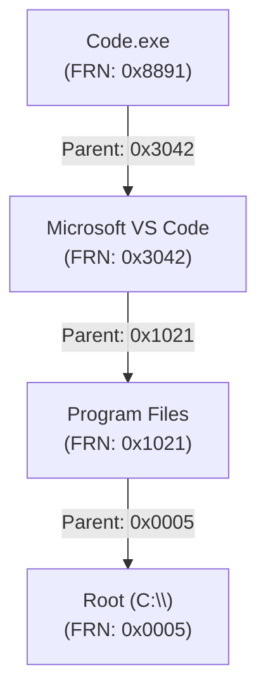
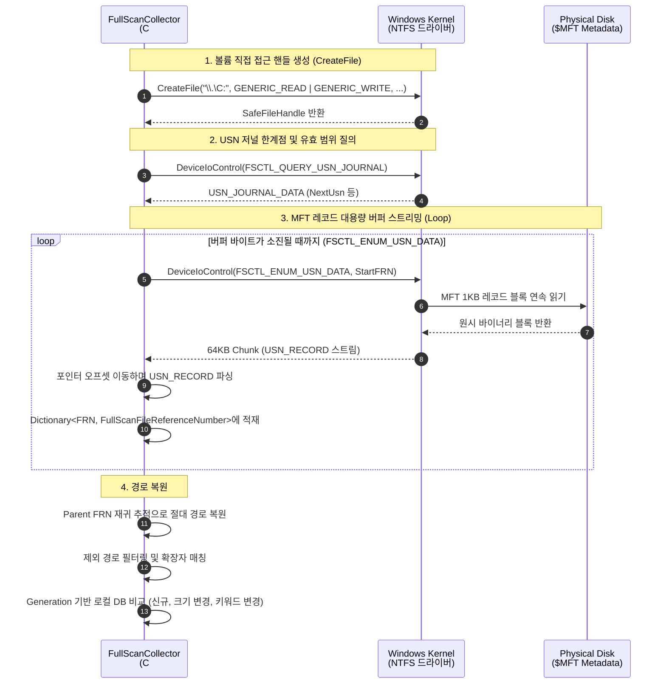

## 잠들어 있는 사내 자산을 찾아라
사용자가 어디에 저장해 두었는지 잊어버려 어느 PC 에 회사 자산이 얼마나 있는지 조사하는 것은 여간 어려운 일이 아니다. 실시간 커널 File I/O 이벤트만으로는 사용자가 핸들링한 파일만 수집되므로 이것만으로는 부족하다. 따라서 하루에 한 번 시스템 전체를 풀스캔하여 숨어있는 자산의 위치를 찾아내고, 이후 발생하는 File I/O 이벤트와 교차 검증을 거치면 비로소 시작점에 설 수 있다.

사용자 PC 구석구석을 확인하는 것은 현실적으로 어려운 문제들이 있는데, 바로 `리소스와 스캔 속도` 였다. <span style="color: var(--color-accent-spec);">수십만 ~ 수백만 개의 파일이 저장된 수백 GB의 디스크를 전통적인 `Directory.GetFiles()` 재귀 탐색으로 순회하면, 디스크 I/O 병목으로 인해 PC가 버벅거리고 검사 시간만 수십 분이 걸린다.</span>

사용자의 업무 흐름을 방해하지 않으면서도 전체 디스크의 파일 목록을 긁어모을 방법이 필요했다. 그리고 해답은 사용중인 초고속 파일 검색 도구로 유명한 [Everything](https://www.voidtools.com/ko-kr/) 에서 찾았다.
<br>
<br>

## MFT(Master File Table)의 원리와 초고속 검색의 비밀
NTFS 파일 시스템은 볼륨 내 모든 파일과 디렉터리의 메타데이터를 1024바이트(1KB) 고정된 크기의 레코드(Record) 로 구성된 거대한 인덱스 테이블인 `$MFT` 파일에 기록해 둔다.

|구분|전통적 재귀 탐색|MFT 직접 열람|
|---|---|---|
|방식|• OS 계층을 거치며 디렉터리를 하나씩 진입<br>• Directory.GetFiles|• 볼륨의 MFT 메타데이터 블록을 메모리로 통째로 연속 읽기<br>• FSCTL_ENUM_USN_DATA|
|디스크| 파일 수만큼 수만 ~ 수십만 번의 오버헤드 발생 | 대용량 버퍼로 순차 읽기 몇 번에 완료 |
|시간| 수십만 개 파일 기준 <span style="color: var(--color-accent-spec);">수 분 ~ 수십 분</span> | 100만 개 파일 기준 <span style="color: var(--color-accent-impl);">1 ~ 3초 내외</span> |
|권한| 일반 사용자 권한으로 실행 가능 | 볼륨 핸들 접근을 위해 관리자 권한 필수 |

MFT 레코드는 각각 고유한 64비트 정수 식별자인 `FRN(File Reference Number)` 을 부여받는다.

<table>
    <thead>
        <tr>
            <th 
                colspan="3" 
                style="text-align: center;">
                MFT Entry Record (1024 Bytes 고정 크기)
            </th>
        </tr>
    </thead>
    <tbody>
        <tr>
            <td 
                colspan="3"
                style="text-align: center;">
                [Header] Magic: "FILE" (4B) | Update Sequence | Flags (0x01: File, 0x02: Directory)
            </td>
        </tr>
        <tr>
            <td>[0x10 Standard Information]</td>
            <td>파일 타임스탬프 (생성/수정/접근), DOS 읽기전용/숨김 속성</td>
        </tr>
        <tr>
            <td>[0x30 File Name]</td>
            <td style="color: var(--color-accent-spec); font-weight: 700;">파일 이름, Parent File Reference Number</td>
        </tr>
        <tr>
            <td>[0x80 Data]</td>
            <td>파일의 실제 데이터 (작은 파일은 레코드 내에 직접 상주) </td>
        </tr>
    </tbody>
</table>

여기서 가장 중요한 속성은 바로 Parent File Reference Number 다. MFT 를 읽으면 전체 경로 문자열 (C:\Users\...\document.docx)이 통째로 들어있는 것이 아니라, 오직 자신의 이름(FileName) 과 자신을 담고 있는 부모 폴더의 고유 번호 (ParentFileReferenceNumber) 만 제공된다.
<br>
<br>

## 데이터에서 디렉터리 트리 역추적
FSCTL_ENUM_USN_DATA 를 통해 가져온 데이터는 계층이 없는 평면적인 리스트다. 

```
[MFT Sequential Read 결과]
FRN: 0x0005 -> Name: "Root"               Parent: 0x0005 (루트)
FRN: 0x1021 -> Name: "Program Files"      Parent: 0x0005
FRN: 0x3042 -> Name: "Microsoft VS Code"  Parent: 0x1021
FRN: 0x8891 -> Name: "Code.exe"           Parent: 0x3042
```


대상 파일의 Parent FRN 을 타고 올라가며 부모 이름을 리스트에 차례대로 쌓은 뒤 이를 뒤집으면, `C:\Program Files\Microsoft VS Code\Code.exe` 라는 절대 경로를 만들어 낼 수 있다.
<br>
<br>

## 저수준 I/O 수집 파이프라인

### 1. 볼륨 루트 핸들 획득
- 드라이브 문자열(\\.\C:)을 통해 볼륨 자체에 대한 파일 핸들 (관리자 권한 및 GENERIC_READ | GENERIC_WRITE 플래그가 필수)

### 2. USN 저널 질의
- DeviceIoControl로 볼륨의 USN_JOURNAL_DATA를 조회하여 현재 볼륨의 NextUsn 값을 확인하고 스캔 범위(MFT_ENUM_DATA)를 초기화
- [FSCTL_QUERY_USN_JOURNAL](https://learn.microsoft.com/ko-kr/windows/win32/api/winioctl/ni-winioctl-fsctl_query_usn_journal)

### 3. 대용량 버퍼를 활용한 MFT 스트리밍
- 약 64KB 크기의 버퍼를 할당하고 반복 루프를 돌며 MFT 레코드들을 확인
- 버퍼에 담긴 USN_RECORD 를 파싱하여 디렉터리와 파일을 구분하고, 고유 식별자인 FileReferenceNumber 와 ParentFileReferenceNumber 를 맵에 저장
- [FSCTL_ENUM_USN_DATA](https://learn.microsoft.com/ko-kr/windows/win32/api/winioctl/ni-winioctl-fsctl_enum_usn_data)

### 4. 절대 경로 복원
- 맵에 쌓인 데이터를 기반으로 Parent FRN 재귀 추적으로 절대 경로 복원
<br>
<br>
