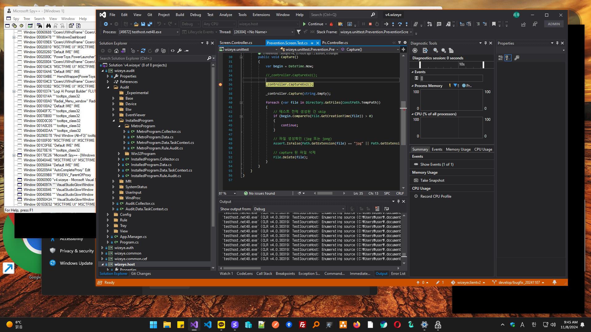
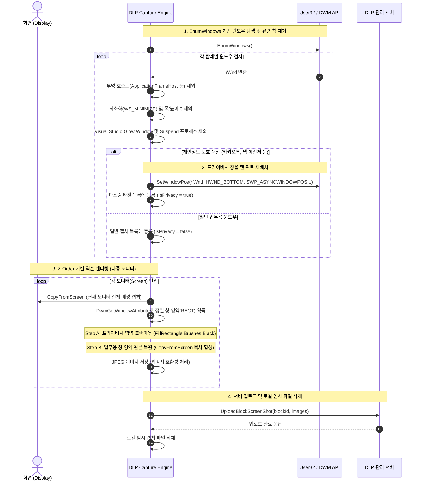
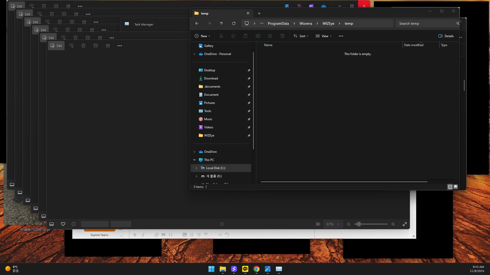

## 증적은 확보하되, 사생활은 가려야 한다
정보 유출 의심 행위가 탐지되었을때 사용자의 데스크톱 화면을 캡처하여 서버로 전송하는 기능이 필요했다. 하지만 업무 화면은 캡처하되, 화면에 떠 있는 카카오톡, 텔레그램이나 웹 메신저 대화창은 마스킹해서 프라이버시 보장이 필요했다.

단순히 전체 화면을 찍어서 보내던 기존 로직을 뜯어고쳐, **개인정보 프로그램만 선별하여 검은색으로 칠하고 나머지 업무 창은 온전하게 합성**하는 정교한 캡처 파이프라인을 설계해야 했다.
 
 

## 눈에 보이지 않는 윈도우들의 방해
간단히 [EnumWindows](https://learn.microsoft.com/ko-kr/windows/win32/api/winuser/nf-winuser-enumwindows) 로 창 핸들을 순회하며 대상 좌표를 구해 마스킹하면 끝날 줄 알았지만, 실제로는 캡처 퀄리티를 떨어뜨리는 온갖 문제들이 존재했다.

### 1. 크기는 잡히는데 투명한 더미 윈도우
`ApplicationFrameHost.exe`, `ShellExperienceHost.exe`, `TextInputHost.exe` 등 UWP/쉘 호스트 프로세스들은 실제 화면에 보이지 않아도 거대한 사각형 영역을 유지하고 있었다.

### 2. 프로세스는 일시중단 상태인데 영역만 존재하는 창
`SystemSettings.exe`(Windows 설정) 등은 백그라운드에서 Suspend 상태로 투명 창을 잡고 있어 화면을 엉뚱하게 가렸다.

### 3. 창 모드일 때만 생기는 외곽선 효과
Visual Studio(`devenv.exe`)의 경우 창 모드일 때 창 주변에 비주얼 이펙트를 주기 위해 `VisualStudioGlowWindow`라는 별도 클래스 창을 외곽에 띄워 좌표를 오염시켰다.

### 4. DWM 투명 그림자와 라운드 코너
기본 [GetWindowRect](https://learn.microsoft.com/ko-kr/windows/win32/api/winuser/nf-winuser-getwindowrect) 를 호출하면 Windows 10/11 의 DWM 그림자 여백까지 좌표에 포함되어, 마스킹 박스가 실제 창보다 사방으로 수 픽셀씩 뚱뚱하게 그려지는 문제가 있었다. 이를 해결하기 위해 필터링 규칙을 세밀하게 정의하고, 좌표 보정을 위해 [DwmGetWindowAttribute (DWMWA_EXTENDED_FRAME_BOUNDS)](https://learn.microsoft.com/ko-kr/windows/win32/api/dwmapi/nf-dwmapi-dwmgetwindowattribute) 를 도입해야 했다.
 
 

## 캡처 및 마스킹 파이프라인

프라이버시 창을 깔끔하게 가리기 위해 Z-Order 재배치와 3단계 캔버스 렌더링을 적용했다.

### 1. 화면 탐색 및 불필요한 유령 윈도우 필터링
- EnumWindows 로 현재 바탕화면의 윈도우 핸들을 탐색
- ApplicationFrameHost, TextInputHost 등 보이지 않으면서 영역만 잡는 호스트 프로세스는 무시
- SystemSettings 처럼 프로세스 상태가 Suspended 인 경우와 devenv.exe 의 `glow 클래스` 를 가진 시각효과 서브 윈도우를 사전에 필터링

### 2. 브라우저 기반 웹 메신저 식별 및 Z-Order 재배치 (HWND_BOTTOM)
- 설치형 메신저 외에도 브라우저로 접속한 웹 메신저를 가려내기 위해 엔진 타입별(Chromium, IE) URL 수집 모듈을 호출하여 대상 웹앱 여부를 확인
- 마스킹 대상 창은 [SetWindowPos](https://learn.microsoft.com/ko-kr/windows/win32/api/winuser/nf-winuser-setwindowpos) 를 호출해 HWND_BOTTOM(IntPtr(1))으로 밀어 넣는다. 이렇게 하면 다른 업무용 창들 뒤로 자연스럽게 가라앉아 불필요한 시각적 충돌을 방지할 수 있다.

### 3. DWM 정밀 영역 계산 및 2-Pass 렌더링
- 창 크기를 구할 때 단순 GetWindowRect 대신 DwmGetWindowAttribute(DWMWA_EXTENDED_FRAME_BOUNDS) 를 사용하여 그림자와 라운드 코너 투명 영역이 제거된 실제 물리적 창 경계를 계산
- Pass 1 : 개인정보 창 영역을 FillRectangle(Brushes.Black)으로 마스킹
- Pass 2 : 일반 업무 창 영역을 마스킹 레이어 위에 덧그린다. 이 과정을 통해 개인 메신저 위에 겹쳐 있던 정상 업무 창의 가독성을 그대로 보존
 
 

## 개인 프라이버시는 지키고 업무 맥락은 살린 화면 캡처

수정된 파이프라인을 적용해 테스트를 진행한 결과, 의도했던 대로 캡처가 동작했다. 화면 내 활성화된 파일 탐색기 및 업무 창들은 픽셀 단위로 온전하게 캡처되어 보안 감사용으로 활용할 수 있게 되었다. 반면 화면 뒤편이나 구석에 배치되어 있던 개인 메신저(카카오톡, 텔레그램 등) 창은 깔끔하게 검은색으로 마스킹 처리되었다. 
 
 

## 정리
- 단순 [CopyFromScreen](https://learn.microsoft.com/ko-kr/dotnet/api/system.drawing.graphics.copyfromscreen?view=windowsdesktop-10.0) 을 호출하는 일반 화면 캡처와 달리, 보안 증적 확보와 사용자 프라이버시 보호라는 상충되는 두 가치를 모두 충족시키는 파이프라인
- 라운드 코너나 외곽 그림자 투명 영역으로 인한 마스킹 오차를 줄이고 캡처 퀄리티를 보장
- Windows 내부의 특이한 윈도우들을 하나씩 분석해 예외 처리
