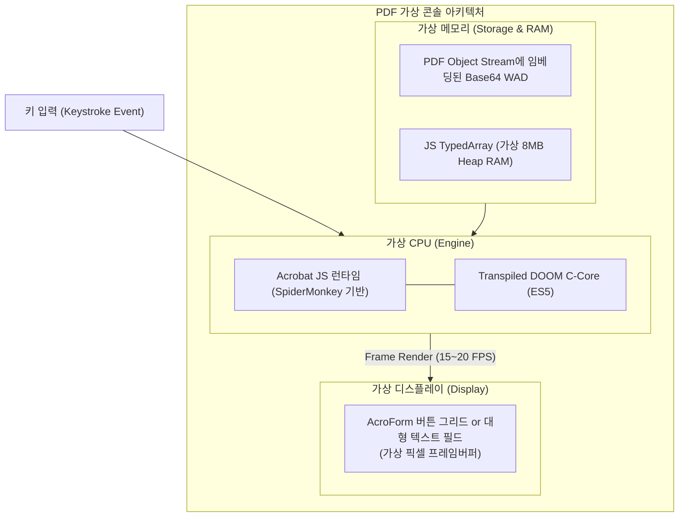
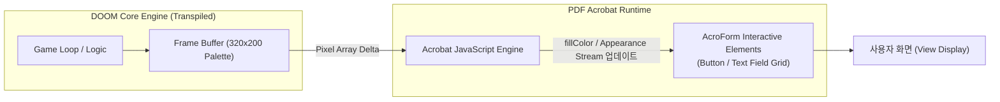
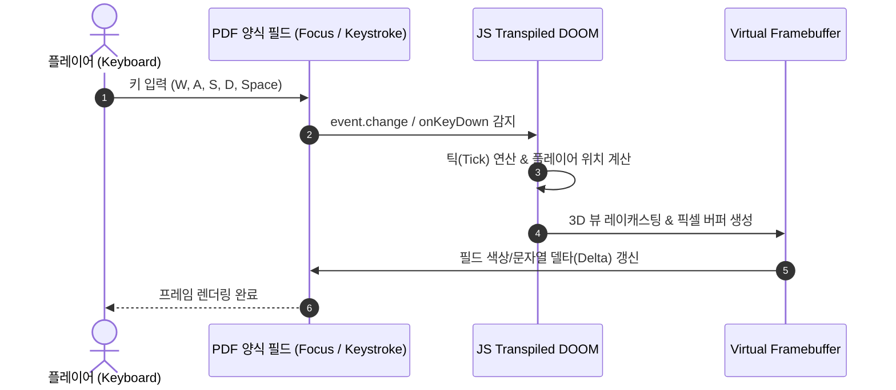

## PDF 뷰어를 게임 콘솔로 속이기

PDF 뷰어(Adobe Acrobat Reader 등)를 게임 머신으로 둔갑시키기 위해 필요한 하드웨어 3요소(CPU, RAM, 디스플레이)를 PDF 스펙 안에서 다음과 같이 에뮬레이션했다.

- CPU: Acrobat Reader 에 내장된 고대 자바스크립트 엔진(AcroJS)
- RAM: 단일 거대 TypedArray(Uint8Array)로 할당된 가상 선형 메모리
- ROM (카트리지): PDF 내부 Object Stream에 Base64로 압축 저장된 `DOOM1.WAD`
- 디스플레이 (VRAM): 유저 인터랙션용 PDF 폼(AcroForm) 필드

## 렌더링 파이프라인: 캔버스가 없으면 버튼을 픽셀로 쓴다

현대 웹 환경에서는 `<canvas>` 엘리먼트에 버퍼 데이터를 밀어 넣으면 그만이지만, PDF 표준에는 실시간 고속 프레임버퍼 렌더러가 존재하지 않는다. 이를 돌파하기 위해 고안된 아키텍처는 놀라울 정도로 기발하다.

1) AcroForm 폼 필드의 픽셀화 (Grid of Form Elements)
PDF의 양식(Form) 컴포넌트 중 버튼(button)이나 텍스트 박스(textfield)는 스크립트를 통해 배경색(fillColor)이나 테두리, 아이콘 속성을 동적으로 바꿀 수 있다.

화면 영역을 미세한 그리드 형태의 양식 필드로 쪼갠다.

각 필드를 하나의 가상 픽셀(Pixel)로 취급한다.

렌더링 프레임이 갱신될 때마다 스크립트가 해당 좌표 필드의 색상 값을 RGB 배열에 맞춰 변경한다.

2) 텍스트 폰트 기반 아스키/블록 렌더링 (ASCII / Unicode Block Rendering)
해상도를 높이고 DOM 객체 폭증을 막기 위한 또 다른 기법은 단일 대형 텍스트 박스에 모노스페이스 폰트(Monospace Font)와 유니코드 블록 문자(█, ▓, ▒, ░)를 렌더링하는 방식이다.

원본 320×200 해상도의 프레임 버퍼를 밝기/명암(Grayscale) 단계로 매핑한다.

초당 수십 번 단일 app.setTimeOut 혹은 반복 이벤트 루프를 통해 대형 텍스트 필드의 value 문자열을 통째로 덮어쓴다.

## 엔진 포팅: C에서 JS, 그리고 AcroJS 제약 돌파

1) Emscripten과 Transpiler
오리지널 리눅스 둠(Linux Doom) 소스코드는 C로 작성되어 있다. 현대 웹 포팅은 통상 Emscripten을 통해 WebAssembly(WASM)로 컴파일되지만, PDF 뷰어의 내장 JS 엔진은 WASM을 지원하지 않는다.

따라서 원본 소스를 순수 ES5 수준의 순수 자바스크립트(Pure JS)로 트랜스파일해야 한다.

메모리 구조는 대형 전역 TypedArray(Uint8Array 또는 일반 Array)를 가상 RAM/힙 공간으로 선언하여 포인터 연산을 흉내 낸다.

2) WAD 파일의 인라인 내장
둠 구동의 핵심인 그래픽, 사운드, 맵 데이터 팩(DOOM1.WAD)은 별도의 파일로 둘 수 없으므로, Base64 인코딩을 거쳐 PDF 객체 스트림(Object Stream) 또는 스크립트 변수 내부의 거대한 바이너리 청크로 내장된다. 게임 초기화 시 JS가 이를 메모리로 역직렬화하여 텍스처와 레벨 데이터를 빌드한다.

3) 이벤트 루프와 비동기 딜레이의 한계 극복
일반적인 브라우저와 달리 PDF JS 런타임은 requestAnimationFrame 같은 게임 전용 렌더 루프 API가 없다.

app.setTimeOut 또는 app.setInterval의 최소 해상도(Tick resolution)는 데스크톱 환경에 따라 50ms~100ms 수준으로 제한적이다.

따라서 초당 35fps를 자랑하던 둠의 원본 틱레이트 대신, 초당 10~15fps 수준으로 렌더링 주기를 제한하고, 키 입력 이벤트가 들어올 때만 화면을 갱신하는 델타 업데이트 최적화를 통해 프레임 드랍을 방어한다.

## 재미를 넘어선 보안 관점의 시사점
"문서 안에서 둠이 돌아간다"는 유쾌한 해커 문화의 결과물이지만, 정보보안(InfoSec) 관점에서는 결코 가볍게 넘길 수 없는 강력한 경고 메시지를 담고 있다.

|구분|일반 사용자의 인식|실제 PDF 엔진의 현실|
|---|---|---|
|파일 성격|안전한 읽기 전용 문서|• 튜링 완전 복합 실행 파일|
|스크립트 위험도|단순 계산/양식 자동완성|• 임의 연산 • 메모리 조작 • 외부 연결(L7) 가능|
|공격 표면|텍스트 파서 결함 수준|• 복잡한 인터프리터 • JIT 엔진 • 폰트 렌더러 결함 내포|

PDF 내부에서 3D 게임 엔진을 실시간으로 돌릴 수 있을 정도의 연산력과 유연성이 제공된다는 것은, 공격자 역시 복잡한 난독화(Obfuscation), 안티 디버깅, 조건부 페이로드 복호화 루틴을 문서 파일 하나만으로 손쉽게 구현할 수 있음을 의미한다.

실제로 수많은 APT 공격과 악성코드 캠페인이 PDF 내장 자바스크립트의 취약점을 파고들어 힙 스프레잉(Heap Spraying)이나 RCE(원격 코드 실행)를 달성해 왔다.

## 정리
Doom in a PDF는 PDF 표준이 지닌 내장 스크립트 엔진(AcroJS)과 양식 객체(AcroForm)의 극한을 끌어올려 구현한 아키텍처 해킹의 결정체다.

캔버스나 가속 API가 없는 환경에서도 양식 필드를 픽셀화하거나 모노스페이스 블록 문자로 변환하는 기발한 렌더 파이프라인을 통해 기술적 제약을 돌파했다.

이 경이로운 실험은 "PDF는 단순한 종이의 디지털 사본이 아니라, 언제든 임의의 코드를 실행할 수 있는 잠재적 런타임"이라는 사실을 기술적으로 다시 한번 증명해 준다.