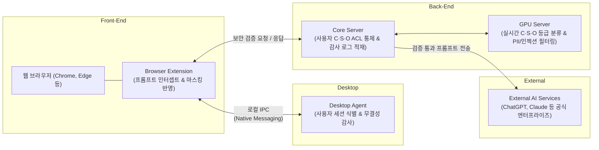

## 1. 획일적 망분리의 한계와 N2SF 의 등장

그동안 공공기관 및 주요 엔터프라이즈 환경을 지탱해 온 핵심 보안 원칙은 **물리적 망분리**였다. 외부 인터넷과 내부 업무망을 물리적으로 완벽히 격리함으로써 침해 사고를 원천 차단해 왔지만, 업무 환경이 급변하면서 극심한 비효율을 마주하게 되었다.

- **업무 비효율 극대화:** 인터넷을 통한 자료 수집이나 외부 파트너와의 협업 시 불필요한 결재 절차와 시간 낭비가 발생했고, 책상 위에 두 대의 PC를 두고 번갈아 사용하는 물리적 불편함과 번거로운 망 연계 시스템 전송 절차가 상존했다.
- **신기술 도입의 장벽:** ChatGPT, Claude 등 글로벌 상용 생성형 AI와 클라우드 기반 생산성 도구가 쏟아져 나왔지만, 망분리 환경에서는 이러한 신기술의 업무 접목이 원천 차단되었다.

업무 정보와 정보시스템의 중요도를 고려하지 않고 일률적으로 분리하던 **획일적 규제에서 벗어나, 데이터 등급에 맞춘 차등화된 보안 대책을 적용**하고자 국가 차원의 새로운 가이드라인인 **N2SF(National Network Security Framework)**가 등장했다.
 
 

## 2. N2SF 기반 외부 AI 이용 ACL 등급 체계 (C · S · O)

N2SF는 업무 데이터의 기밀성과 중요도에 따라 3단계 등급 체계(C·S·O)를 정의하고, 이에 부합하는 차등 접근 통제를 요구한다.

| 등급 | 데이터 성격 | 외부 AI 이용 통제 기준 |
| :--- | :--- | :--- |
| **C 등급 (Confidential)** | 핵심 영업비밀, 미공개 기술, 내부 전용 데이터 | **• 외부 AI 전송 금지:** 외부 LLM API 직접 호출 엄격 차단 • **암호화 통제:** 데이터 이동 및 저장 시 최고 등급 암호화 적용 |
| **S 등급 (Sensitive)** | 개인식별정보(PII), 고객 데이터, 내부 업무 문서 | **• 조건부 허용:** N2SF 보안 게이트웨이를 통한 정밀 검증 • **비식별화 처리:** PII 마스킹 및 데이터 가공 후 전송 • **사전 승인제:** AI 서비스별 보안성 검토 완료 후 이용 |
| **O 등급 (Official)** | 공개 데이터, 일반 업무 자료 조사 | **• 자유 활용:** 지정된 승인 외부 AI 서비스 표준 이용 • **기본 가이드 준수:** 프롬프트 입출력 보안 가이드 적용 |

우리가 달성하고자 한 핵심 개발 목표는 세 가지였다:
1. **외부 생성형 AI 서비스 이용 제한 (ACL 적용):** 사용자에게 할당된 권한에 따라 외부 AI 서비스 접근을 선별적으로 통제
2. **AI 기반 보안 등급의 실시간 분류:** 사용자가 입력하는 프롬프트 및 첨부파일 컨텐츠의 보안 등급을 AI를 통해 실시간 자동 분류
3. **프롬프트 및 컨텐츠 필터링:** PII(개인식별정보) 노출 방지 및 Prompt Injection / Leaking 공격에 대한 실시간 방어 필터 적용
 
 

## 3. 전체 컴포넌트 아키텍처 구성

사용자의 업무 흐름을 방해하지 않으면서도 전송 데이터를 꼼꼼히 감시하기 위해, 프론트엔드부터 엔드포인트, 백엔드 서버 및 외부 AI 연계망까지 4개의 핵심 계층으로 컴포넌트를 설계했다.

각 컴포넌트의 역할과 책임
Front-End (Browser Extensions):

사용자가 크롬, 엣지 등 브라우저 환경에서 생성형 AI 웹 인터페이스에 입력하는 프롬프트 및 첨부파일 업로드 이벤트를 전송 직전에 인터셉트한다.

백엔드의 보안 검증 결과(승인/차단/마스킹)를 바탕으로 UI 수준에서 전송을 제어하고 경고를 표시한다.

Desktop (Desktop Agent):

사용자 단말(PC)에 상주하며 현재 로그인한 사용자의 신원과 세션 상태를 검증하고, 브라우저 확장 프로그램과 로컬 IPC(Native Messaging)를 통해 실시간 상태를 동기화한다.

단말 무결성 유지 및 에이전트 우회 시도를 감시한다.

Back-End (Core Server & DB):

기업 인사 DB 및 보안 정책과 연동하여 사용자별 C·S·O 등급 인가 권한(ACL)을 관리한다.

모든 AI 이용 요청의 메타데이터와 감사 로그를 중앙에 적재한다.

Back-End (GPU Server):

프롬프트 텍스트와 첨부파일 본문을 전달받아 실시간 C·S·O 보안 등급 분류, Prompt Injection 탐지, PII 마스킹을 수행하는 고성능 추론 엔진이다.

External (External AI Services):

보안 검증과 비식별화 과정을 최종 통과한 안전한 프롬프트만을 전달받아 처리하는 OpenAI, Anthropic 등의 상용 외부 AI 서비스군이다.

