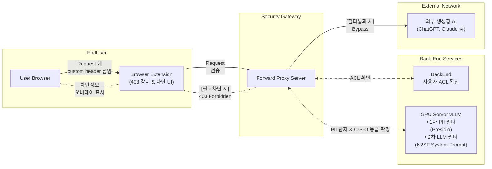

## 획일적 망분리의 한계와 N2SF 의 등장

그동안 공공기관 및 주요 엔터프라이즈 환경을 지탱해 온 핵심 보안 원칙은 물리적 망분리였다. 외부 인터넷과 내부 업무망을 물리적으로 완벽히 격리함으로써 침해 사고를 원천 차단해 왔지만, 업무 환경이 급변하면서 극심한 비효율을 마주하게 되었다.

- **업무 비효율 극대화:** 인터넷을 통한 자료 수집이나 외부 파트너와의 협업 시 불필요한 결재 절차와 시간 낭비가 발생했고, 책상 위에 두 대의 PC를 두거나 VDI 와 같은 추가 업무 시스템을 번갈아 사용하는 불편함과 번거로운 망 연계 시스템 전송 절차가 스트레스였다
- **신기술 도입의 장벽:** ChatGPT, Claude 등 글로벌 상용 생성형 AI와 클라우드 기반 생산성 도구가 쏟아져 나왔지만, 망분리 환경에서는 이러한 신기술의 업무 접목이 원천 차단되었다

업무 정보와 정보시스템의 중요도를 고려하지 않고 일률적으로 분리하던 획일적 규제에서 벗어나, 데이터 등급에 맞춘 차등화된 보안 대책을 적용하고자 국가 차원의 새로운 가이드라인인 N2SF(National Network Security Framework)가 등장했다.
 
 

## N2SF 기반 외부 AI 이용 ACL 등급 체계 (C · S · O)

N2SF는 업무 데이터의 기밀성과 중요도에 따라 3단계 등급 체계(C·S·O)를 정의하고, 이에 부합하는 차등 접근 통제를 요구한다.

| 등급 | 데이터 성격 | 외부 AI 이용 통제 기준 |
| :--- | :--- | :--- |
| **C 등급 (Confidential)** | 핵심 영업비밀, 미공개 기술, 내부 전용 데이터 | • 외부 AI 전송 금지 (외부 LLM API 직접 호출 엄격 차단) • 암호화 통제 (데이터 이동 및 저장 시 최고 등급 암호화 적용) |
| **S 등급 (Sensitive)** | 개인식별정보(PII), 고객 데이터, 내부 업무 문서 | • 조건부 허용 (N2SF 보안 게이트웨이를 통한 정밀 검증) • 비식별화 처리 (PII 마스킹 및 데이터 가공 후 전송) • 사전 승인제 (AI 서비스별 보안성 검토 완료 후 이용) |
| **O 등급 (Official)** | 공개 데이터, 일반 업무 자료 조사 | • 자유 활용 (지정된 승인 외부 AI 서비스 표준 이용) • 기본 가이드 준수 (프롬프트 입출력 보안 가이드 적용) |

달성하고자 한 핵심 개발 목표는 세 가지였다
1. 외부 생성형 AI 서비스 이용 제한 : 사용자에게 할당된 권한에 따라 외부 AI 서비스 접근을 선별적으로 통제 (ACL)
2. AI 기반 보안 등급의 실시간 분류 : 사용자가 입력하는 프롬프트 및 첨부파일 컨텐츠의 보안 등급을 AI를 통해 실시간 자동 분류
3. 프롬프트 및 컨텐츠 필터링 : PII(개인식별정보) 노출 방지 및 Prompt Injection / Leaking 공격에 대한 실시간 방어 필터 적용
 
 

## 전체 컴포넌트 아키텍처 구성

사용자의 업무 흐름을 방해하지 않으면서도 전송 데이터를 꼼꼼히 감시하기 위해, 프론트엔드부터 엔드포인트, 백엔드 서버 및 외부 AI 연계망까지 4개의 핵심 계층으로 컴포넌트를 설계했다.

 
 

## 각 컴포넌트의 역할

### 1. Browser Extension

- 사용자가 브라우저에서 생성형 AI 로 전송하는 요청은 설정된 Forward Proxy 로 전달
- 브라우저에 설치된 확장 프로그램은 생성형 AI 요청에 서비스를 위한 커스텀 헤더를 추가
- 프록시로부터 보안 정책 위반으로 인한 403 Forbidden 응답을 수신하면 사용자가 보는 페이지에 N2SF 보안 정책 위반 안내를 오버레이 하여 실시간으로 표시

### 2. Security Gateway

- 트래픽을 가로채 내부 백엔드 및 GPU 분석 서버로 전달해 검증 요청
- 필터를 모두 정상 통과한 트래픽은 외부 ISP 로 그대로 Bypass 시켜 서비스 이용하고 보안 위반 시에는 403 에러를 반환

### 3. BackEnd
- 요청한 사용자의 접근 권한(ACL) 및 개인정보(PII) 여부와 C·S·O 등급(N2SF) 을 실시간으로 확인
  - 1차 PII 필터 (Presidio) : 정규식 및 경량 NER 기반으로 프롬프트 내 개인정보(전화번호, 주민등록번호, 계좌 등)를 탐지 및 마스킹 처리
  - 2차 LLM 필터 (N2SF System Prompt) : N2SF 보안 가이드라인과 고객특화된 시스템 프롬프트를 기반으로 C·S·O 등급 분류 및 악의적인 Prompt Injection/Leaking 시도를 실시간 판단
- AI 서비스 이용 요청에 대한 메타데이터 감사 이력을 저장하여 사후 추적성을 확보

### 4. External
- 비식별화와 보안 검증을 통과한 안전한 트래픽만 외부 생성형 AI 서비스를 정상 이용

