## 프록시만으로는 풀리지 않는 두 가지 문제

Forward Proxy 를 띄워 사용자 트래픽을 가로채고 PII 마스킹과 N2SF 등급 분류를 적용하는 것까지는 성공했다. 하지만  운영상 치명적인 두 가지 문제점을 발견했다.

### 1. 누가, 어느 PC에서 보낸 요청인가?

- 프록시 입장에서는 패킷의 IP 만 보일 뿐, 현재 브라우저를 사용중인 엔드유저가 누군지, 어느 PC 에서 사용하고 있고 권한이 있는지를 알 수 없었다. 
- WFP(Windows Filtering Platform) 커널 드라이버를 개발해 프로세스와 패킷을 태깅하는 방식도 검토했으나, 현재 단계에서는 오버엔지니어링이었다.

### 2. 사용자는 왜 먹통이 되었는지 모른다

- 프록시가 N2SF 정책(C등급 기밀 전송 등)에 걸려 `403 Forbidden` 에러를 반환하면, ChatGPT 나 Gemini 화면에는 서비스 자체의 불친절한 네트워크 장애 메시지 "요청을 처리할 수 없습니다" 만 표시될 뿐이었다. 사용자는 자신이 사내 보안 규정을 위반해서 차단된 것인지, AI 서비스 장애인지 구분할 수 없었다.

WFP 같은 무거운 커널 기술 없이, 사용자 인증 헤더를 주입하고 웹 화면에 친절한 보안 차단 오버레이를 띄울 가장 확실한 방법은 '브라우저 확장 프로그램(Browser Extension)'이었다.
 
 

## 데스크탑 앱의 필연성과 온프레미스 브릿지

브라우저 확장 프로그램을 도입하기로 결정했지만, 확장 프로그램은 브라우저 샌드박스에 갇혀 있어 시스템 레벨의 권한이 없다. 다행히도 우리 아키텍처에서 **C++ 기반 데스크탑 에이전트**는 이미 다음 역할을 하고 있었다.

- 루트 CA 인증서 관리
  - 프록시에서 패킷 복호화를 위해 프록시 CA 인증서를 '신뢰할 수 있는 루트 인증 기관'에 등록
  - 만료 및 서버 업데이트로 인한 인증서 업데이트 지원
  - 사용자의 임의 변경을 감시하고 복원
- 프록시 설정
  - 프록시를 바라볼 수 있게 시스템 설정
  - 제어판에서 임의 설정할 수 없게 UI 비활성화 (HKEY_CURRENT_USER\Software\Policies\Microsoft\Internet Explorer\Control Panel)
  - 사용자가 임의 변경을 감시하고 복원
- 온프레미스 브릿지
  - 브라우저 스토어의 정책상 고객사마다 다른 환경파일을 갖는 형태로 확장 프로그램을 배포할 수는 없다 (https://developer.chrome.com/docs/webstore/program-policies/spam-and-abuse)
  - 따라서, 고객마다 배포되는 데스크탑 앱을 통해 확장 프로그램과 사내 백엔드 사이의 통신 중계하는 역할을 수행

|기능|스크린샷|
|---|---|
|인증서 등록|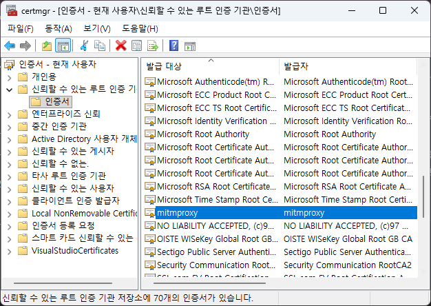|
|Registry|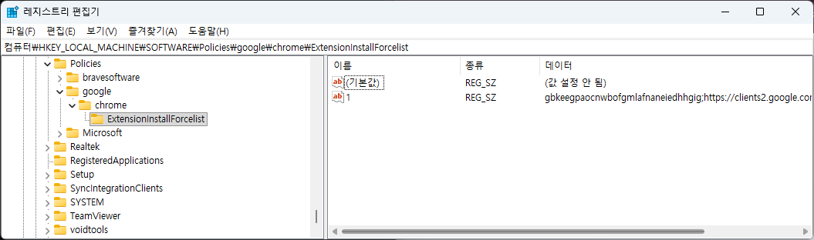|
|policies.json|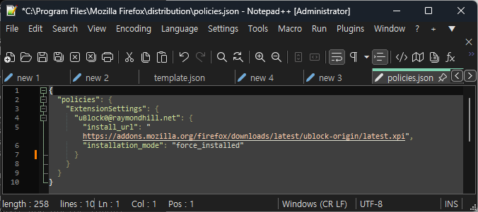|
|설정 UI 비활성화|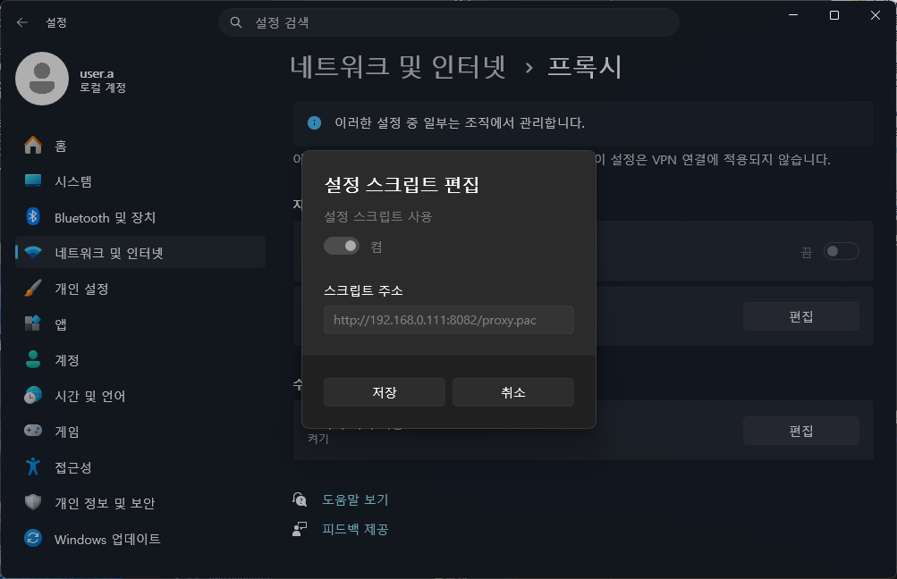|

의도치 않았지만, 이 데스크탑 에이전트의 존재 덕분에 "사용자 개입 없는 확장 프로그램 강제 배포와 삭제 방지"라는 문제를 소프트웨어 레벨에서 자연스럽게 해결할 수 있었다.
 
 

## Active Directory 없이 브라우저 확장 강제 설치하기

대기업처럼 중앙 도메인 컨트롤러(AD) 와 그룹 정책(GPO) 인프라가 갖춰진 곳이라면 정책 배포가 간단하다. 하지만 중소·중견기업 고객사들은 도메인 가입 환경을 갖추지 않은 경우가 태반이다. 

따라서, 데스크탑 에이전트가 설치 및 실행 시점에 로컬 레지스트리와 브라우저 배포 설정 파일(policies.json)을 추가하여 확장을 로드하도록 구현했다.

|브라우저|방식|경로|데이터|
|---|---|---|---|
|Chrome|Registry|• HKLM • SOFTWARE\Policies\Google\Chrome\ExtensionInstallForcelist|• name: {index} • type: REG_SZ • value: {extension_id};{update_url}|
|Edge|Registry|• HKLM • SOFTWARE\Policies\Microsoft\Edge\ExtensionInstallForcelist|• name: {index} • type: REG_SZ • value: {extension_id};{update_url}|
|Firefox|JSON|• {ProgramFiles} • Mozilla Firefox\distribution\policies.json| `{"policies": {"ExtensionSettings": {...}}}`|

이 정책이 적용되면 브라우저 관리 메뉴에서 확장 프로그램 옆에 "조직에 의해 관리됨(설치됨)" 아이콘이 붙으며, 사용자가 임의로 확장을 비활성화하거나 삭제할 수 있는 스위치가 완전히 비활성화된다.

|Chrome|Edge|Firefox|
|---|---|---|
|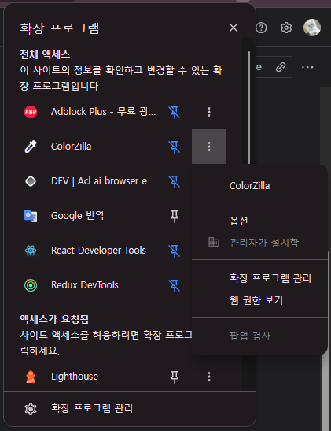|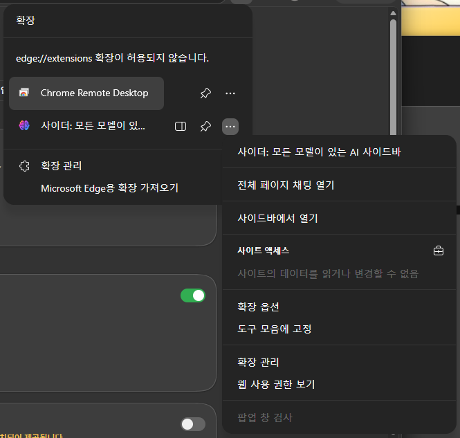|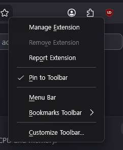|

 
 

## 확장 프로그램의 4가지 핵심 임무
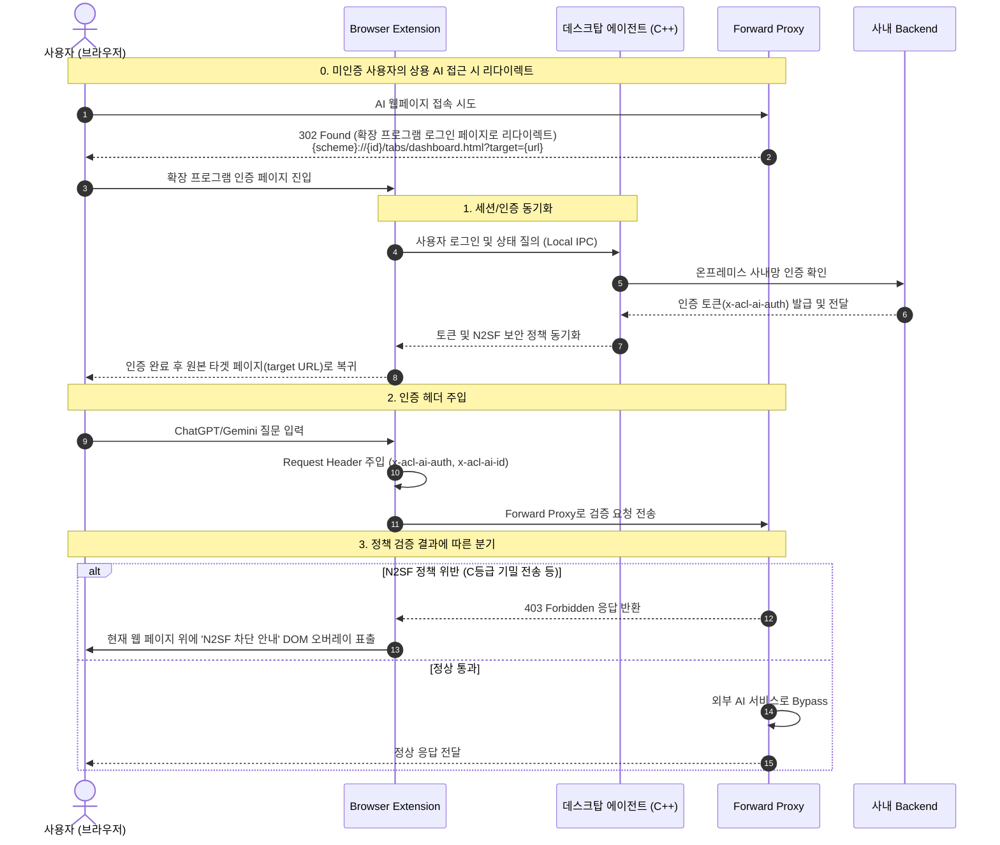

### 1. 미인증 사용자 리다이렉트
인증 토큰이 없거나 만료된 상태에서 AI 서비스에 접근하면, 프록시가 `302 Found` 로 브라우저별 고유 스킴에 맞춘 확장 프로그램 로그인 페이지로 리다이렉트
|브라우저|Scheme|
|---|---|
|Chrome|chrome-extension://{id}/tabs/dashboard.html?target={url}|
|Edge|extension://{id}/tabs/dashboard.html?target={url}|
|Whale|whale-extension://{id}/tabs/dashboard.html?target={url}|
|Firefox|moz-extension://{id}/tabs/dashboard.html?target={url}|

### 2. 상용 AI 서비스 요청에 Custom Header 주입
- 브라우저 확장이 AI 서비스(Gemini, ChatGPT, Claude) 로 향하는 요청을 감지
- 헤더에 `x-acl-ai-auth(사용자 인증 토큰)`, `x-acl-ai-id(확장 ID)` 를 동적으로 주입하여 프록시가 요청 주체를 즉시 식별할 수 있게 지원

### 3. 데스크탑 앱과 통신
- 사내 백엔드와 안전하게 통신하기 위해 데스크탑 앱과 표준 입출력(stdio) 기반 Native Messaging 파이프를 유지
- 사용자 로그인 세션 갱신, 보안 정책 업데이트를 에이전트로부터 전달받아 실시간 적용

### 4. 403 차단 응답 가로채기 및 DOM Injection 오버레이
- 프록시가 정책 위반을 감지해 `403 Forbidden` 을 뱉었을 때, 브라우저 확장이 이 상태를 확인
- 원본 AI 웹페이지의 입력창과 화면 위에 DOM Injection 으로 경고 오버레이

|||
|---|---|
|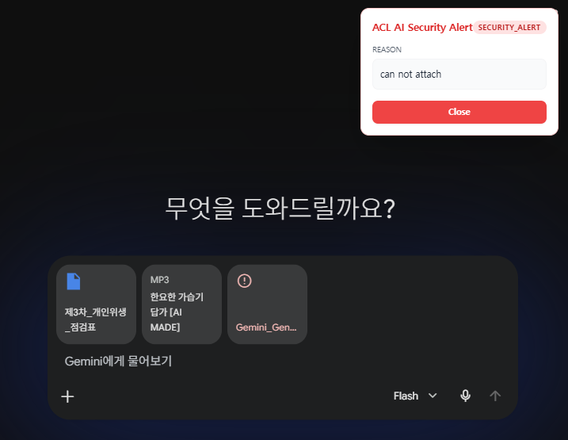|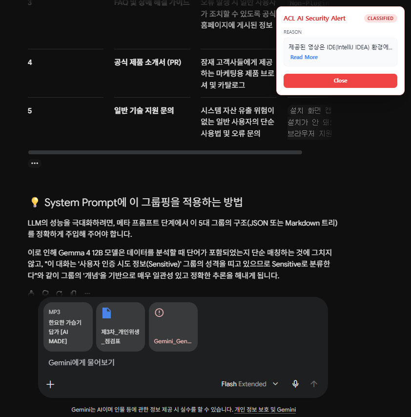|

### 5. C++ 데스크탑 에이전트의 통합 모니터링 루프
- 사용자가 제어판에서 프록시 설정을 끄거나, 인증서 저장소에서 CA 인증서를 삭제하거나, 레지스트리를 건드려 확장을 지우려고 시도할 수 있다

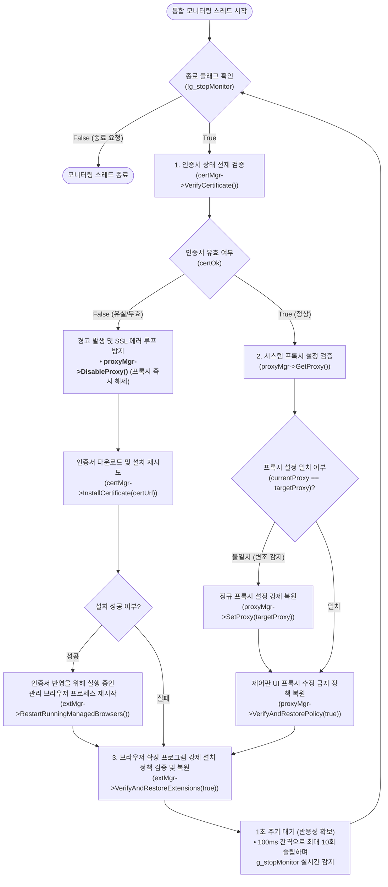
