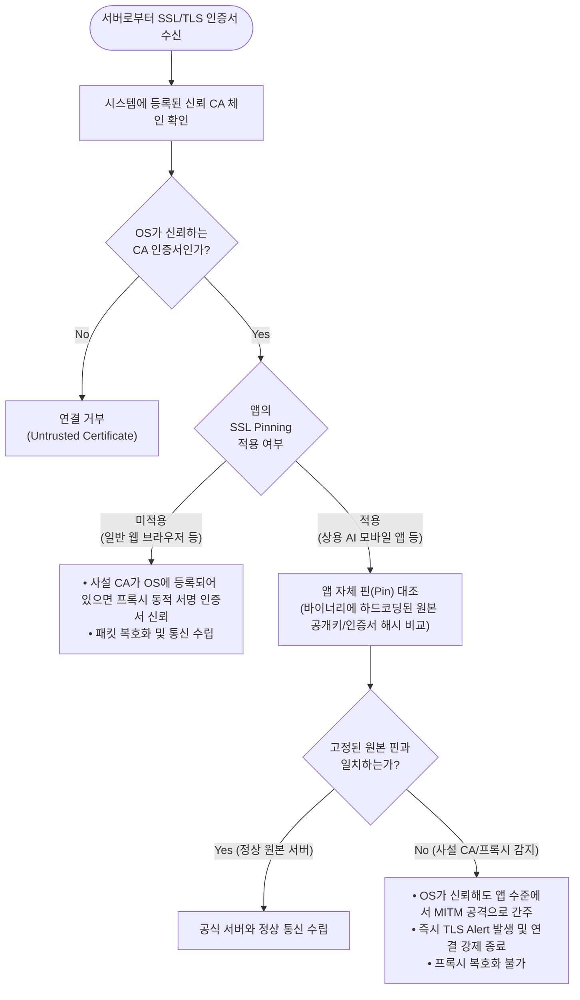

## 캡처는 되지만 열 수 없는 문, 모바일 SSL Pinning
웹 브라우저 환경에서의 트래픽 제어 및 복호화 테스트는 성공적이었다. 다음 단계로 다양한 엔드포인트 환경을 검증하기 위해 모바일 기기(iOS/Android)를 대상으로 테스트를 확장했다.

Wi-Fi 프록시 설정을 통해 모바일 기기에서 발생하는 네트워크 패킷 자체는 프록시 게이트웨이로 정상 인입되었다. 게이트웨이 로그상에서도 `CONNECT api.openai.com:443`과 같은 TLS 핸드셰이크 요청이 명확히 기록되는 것을 확인했다.

그러나 다음 단계인 트래픽 복호화(Decryption) 단계에서 완전히 가로막혔다. 단말 OS의 시스템 신뢰 저장소에 사내 사설 CA 인증서를 정상적으로 설치하고 프로파일 신뢰 설정을 활성화했음에도 불구하고, 프록시가 동적으로 재서명한 인증서를 앱 수준에서 거부했다.

원인은 ChatGPT, Claude 등 주요 상용 AI 공식 모바일 네이티브 앱에 탑재된 SSL Pinning 기법 때문이었다.
 
 

## SSL Pinning의 개념과 검증 방식

SSL Pinning(Certificate/Public Key Pinning)은 클라이언트가 서버와 HTTPS 통신을 수행할 때, 운영체제(OS)의 공용 CA 검증 절차에만 의존하지 않고 앱 내부에 미리 고정(Pin)해 둔 신뢰 대상(인증서 원본 또는 공개키 해시)과 서버의 인증서 정보를 직접 대조 검증하는 보안 기술이다.

이를 통해 신뢰할 수 없는 사설 CA가 OS에 강제 등록되더라도, 앱 차원에서 중간자 공격(MITM)을 원천 차단한다.

| 유형 | 검증 방식 및 특징 | 운영상 트레이드오프 |
|---|---|---|
| Certificate Pinning | 서버 인증서 파일 원본을 앱 리소스에 탑재하고 바이트 단위로 일치 여부 비교 | 인증서 갱신/만료 시 모바일 앱도 강제로 업데이트 배포를 진행해야 함 |
| Public Key (SPKI) Pinning | 인증서 내부의 '주체 공개키 정보(Subject Public Key Info)' SHA-256 해시값만 앱 코드에 하드코딩 | 인증서가 재발급되더라도 동일한 키 쌍(Key Pair)을 유지하면 앱 업데이트 불필요 |

 
 

## 우회 방안 검토와 현실적 한계
모바일 환경에서 SSL Pinning을 우회하여 트래픽을 가시화할 수 있는 몇 가지 기술적 수단을 검토했으나, 전사 보안 솔루션 관점에서는 도입할 수 없는 방식들이었다.

### 1. 탈옥/루팅 기반 메모리 후킹 (Frida 등)
단말을 탈옥(iOS) 또는 루팅(Android)한 후, Frida 스크립트를 주입해 앱 메모리상의 인증서 검증 함수(TrustManager, SecTrustEvaluate 등)를 후킹하여 무조건 참(return true)을 반환하도록 강제하는 방식이다.

- 한계점: 임직원의 개인(BYOD) 및 업무용 단말을 탈옥/루팅하는 것은 사내 MDM 정책 및 금융/보안 컴플라이언스상 원천 금지 대상이다. 또한 앱 버전이 업데이트될 때마다 메모리 오프셋과 심볼이 바뀌어 지속적인 운영 유지가 불가능하다.

### 2. 게이트웨이에서의 모바일 앱 트래픽 전면 차단
복호화할 수 없는 상용 AI 모바일 앱의 SNI(Server Name Indication) 및 IP 대역을 감지하여 게이트웨이 방화벽에서 강제로 드롭(RST/Drop)시키는 방식이다.

- 한계점: 사내 Wi-Fi 연결 상태에서는 차단할 수 있으나, 사용자가 모바일 데이터(LTE/5G)로 전환하면 통제가 즉시 무력화된다. 나아가 합목적적인 모바일 AI 도구 활용 자체를 전면 봉쇄하여 임직원의 생산성과 사용자 경험(UX)을 심각하게 해치는 부작용이 크다.

 
 

## 빠른 실패(Fail-Fast)와 현실적 의사결정
검토 결과, 통제 권한이 없는 서드파티 네이티브 모바일 앱의 트래픽을 프록시 레벨에서 비침습적으로 복호화하는 것은 SSL Pinning 이 정상 동작하는 한 기술적으로 불가능하다는 결론에 도달했다.

보안 관제 범위를 억지로 넓히기 위해 무리한 우회 기법을 프로덕션에 적용하는 것은 운영 부채만 가중시킬 뿐이었다. 결국 "모바일 네이티브 앱 트래픽을 가로채 복호화한다" 는 요구사항은 기술적 한계를 인정하고 프로젝트 스코프에서 드랍하기로 결정했다.
