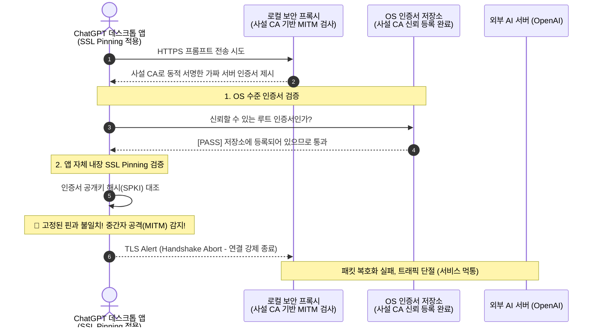

## 프록시 기반 AI 보안 필터라는 야심찬 출발
ChatGPT, Claude 등 외부 생성형 AI 서비스가 사내 업무에 깊숙이 침투하면서, 경영진과 보안팀의 최대 관심사는 **'프롬프트 내부의 기밀 및 개인정보(PII) 유출 방지'**였다.

초기에 구상했던 아키텍처는 매우 직관적이고 전형적인 네트워크 DLP 접근법이었다:

1. 엔드포인트 PC에 로컬 프록시 에이전트를 상주시킨다.
2. PC의 루트 인증서 저장소에 사내 사설 CA 인증서를 설치한다.
3. 브라우저나 데스크톱 앱이 `api.openai.com`이나 웹 서비스로 쏘는 HTTPS 트래픽을 중간에서 가로채 복호화(MITM, 중간자 개입)한다.
4. 평문으로 풀린 프롬프트 텍스트를 앞서 검토한 Presidio 엔진으로 초고속 검사하여 PII를 마스킹하거나 차단한다.
5. 검증이 끝난 트래픽만 다시 암호화해 외부 AI 서버로 전송한다.

이론상으로는 사용자가 브라우저를 쓰든, 전용 데스크톱 앱을 쓰든 모든 AI 트래픽을 단일 통로에서 통제할 수 있는 '은빛 총알(Silver Bullet)' 같아 보였다. 

하지만 실제 필드 환경에 프로토타입을 얹는 순간, 프로젝트의 근간을 뒤흔드는 거대한 암초를 만났다.
 
 

## 복병의 등장: 굳게 닫힌 문, SSL Pinning
일반적인 웹 브라우징 트래픽은 OS에 등록된 사설 CA 인증서만으로 손쉽게 중간 복호화가 가능했다. 

하지만 **OpenAI의 공식 ChatGPT 데스크톱 앱(macOS/Windows), 전용 CLI 도구, 그리고 보안이 강화된 최신 크로미움 브라우저 환경**에서는 사설 인증서를 주입하자마자 모든 네트워크 연결이 `SSL Handshake Failed` 오류를 뿜으며 일제히 차단되었다.

"OS 저장소에 사설 CA를 아무리 신뢰된 루트로 강제 등록해 두어도, 앱 내부에서 통신 자체를 거부하고 완전히 먹통이 되어버렸다."

원인은 바로 대상 애플리케이션들에 적용되어 있던 **SSL Pinning(Certificate / Public Key Pinning)**이었다.

클라이언트 바이너리가 "OS의 CA 저장소가 누구를 신뢰하든 상관없이, 오직 빌드 타임에 하드코딩해 둔 원본 OpenAI 서버의 공개키(SPKI Pin)만을 인정하겠다"고 선언하고 있었던 것이다.
 
 

## 타협할 수 없는 기술적 딜레마
SSL Pinning을 우회하기 위해 취할 수 있는 기술적 수단들을 검토했지만, 기업용 상용 보안 솔루션으로서는 모두 치명적인 결격 사유를 안고 있었다:

### 1. Frida/리버싱 기반 바이너리 인라인 패칭:

클라이언트 프로세스 메모리에 침투해 SSL Pinning 검증 함수를 강제로 후킹(return true)하는 방식.

이는 상용 안티바이러스(EDR)로부터 악성코드(Inject/Tampering)로 오탐되기 십상이고, ChatGPT 앱이 업데이트될 때마다 오프셋이 깨져 유지보수가 불가능했다.

### 2. 트래픽 감청 포기 및 전면 차단:

핀 검증을 우회할 수 없으니 해당 앱의 트래픽을 아예 드롭(Drop)시키는 방식.

사용자의 정상적인 AI 도구 활용을 원천 봉쇄하여 임직원의 거센 반발을 부르고 생산성을 저해했다.

"네트워크 L7 레이어에서 중간자(MITM)로 패킷을 뜯어보겠다는 발상 자체가, 현대 애플리케이션의 엔드투엔드 암호화 및 핀닝 보안 트렌드와 정면으로 충돌하고 있었다."
 
 

## 피봇(Pivot): 네트워크 프록시에서 '애플리케이션 계층'으로
결국 우리는 "네트워크 패킷을 가로채 검사한다"는 초기 아키텍처를 과감히 폐기(Pivot)하기로 결정했다. 암호화가 시작되기 이전, 혹은 서비스 자체가 통제 가능한 영역으로 검증 지점을 끌어올렸다.

 
 

## 새로운 방향성
사내 전용 AI 엔터프라이즈 게이트웨이 구축:

직원이 임의의 외부 데스크톱 앱을 직접 쓰는 대신, 사내에서 제공하는 통합 웹 포털이나 프록시 API 엔드포인트를 통하도록 단일 창구를 일원화했다.

전송 직전 평문 단계에서 선제 차단:

네트워크 카드로 패킷이 나가기 전(암호화 전), 브라우저 확장 프로그램(Extension)이나 게이트웨이 인풋 단계에서 앞서 구축한 Presidio 기반 고속 CPU 필터를 통해 PII를 즉시 탐지하고 마스킹한다.

공식 Enterprise API 연동:

엔드포인트에서 억지로 핀을 풀며 싸우는 대신, 정제된 프롬프트를 사내 백엔드가 안전한 표준 TLS로 외부 공식 엔터프라이즈 API에 전달하도록 설계했다.
 
 

## 정리
네트워크 계층의 사설 CA 주입을 통한 MITM 검사는 과거의 레거시 웹 환경에서는 유효했을지 몰라도, SSL Pinning이 기본 탑재된 최신 SaaS 및 데스크톱 애플리케이션 앞에서는 명확한 한계가 존재했다.

무리하게 클라이언트 핀 검증을 우회하려는 악성코드성 후킹 기법에 매달리기보다, 기술적 한계를 빠르게 인정하고 아키텍처의 검증 계층을 애플리케이션/게이트웨이 레벨로 피봇한 것이 훨씬 안정적이고 지속 가능한 선택이었다.

이 실패와 피봇의 경험 덕분에, 불필요한 네트워크 오버헤드 없이 '암호화 이전 단계에서의 초고속 PII 사전 필터링'이라는 훨씬 경량화되고 우아한 구조에 집중할 수 있게 되었다.