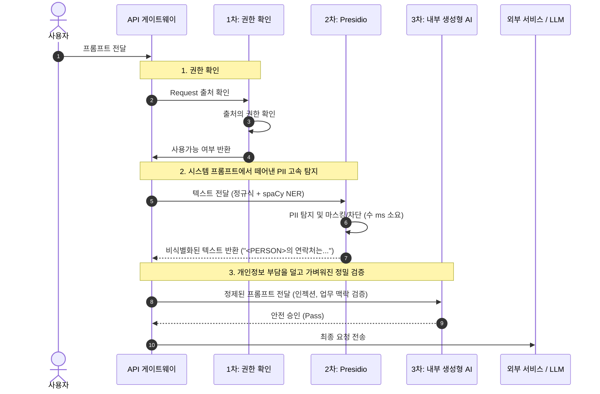

## 내부 생성형 AI 의 판단 지연, 그리고 발상의 전환
사내 사용자가 외부로 전달하는 프롬프트에 민감 정보가 포함되어 있는지 검증하기 위해, 처음에는 `시스템 프롬프트`를 활용해 프롬프트의 유해성이나 보안 위반 여부를 종합적으로 판단하도록 설계했다. 하지만 실제 환경에 적용하기에는 레이턴시가 너무 길었다.

"프롬프트 하나를 판단하는 데 너무 오래걸려 전체 서비스의 응답 지연이 심각하게 늘어났다."

문제는 `시스템 프롬프트` 에 수많은 검증 지침
- 악의적인 프롬프트 인젝션 검증
- 사내 기밀 및 보안 정책 위반 확인
- 주민등록번호, 전화번호, 이메일, 계좌번호 등 개인정보(PII) 포함 여부 확인

모든 판단을 거대한 AI 모델 하나에 전부 몰아주다 보니, 문맥 추론이 필요 없는 단순 형식의 개인정보까지 무거운 딥러닝 연산을 거치며 시간과 GPU 리소스를 사용하고 있었다.

"내부 생성형 AI가 무거운 판단을 내리기 직전에, '가볍지만 확실한 사전 필터'를 앞단에 추가하면 어떨까?"

그렇게 리서치를 거듭하던 중 Microsoft 의 오픈소스 PII 탐지 엔진인 **Presidio**를 찾았다. 기존에 내부 LLM 의 `시스템 프롬프트`에 의존하던 '개인정보 검증' 역할을 떼어내어, 가장 앞단에서 수 밀리초 만에 1차로 걸러내는 경량 사전 필터(Pre-filter) 로 배치하기로 방향을 잡았다.
 
 

## 왜 GPU 없는 사전 필터(CPU)로 충분한가?
내부 LLM의 `시스템 프롬프트`가 확인하던 개인정보의 상당수는 사실 복잡한 생성형 AI 가 필요없는 정형 데이터들이다. Presidio 는 3단계의 경량 구조를 취해 CPU 만으로 판단을 끝낸다.

1. 전화번호, 이메일, 주민등록번호, 신용카드 번호, IP 주소 등 정형화된 PII 는 정규식과 체크섬 검증만으로 수 밀리초 만에 확정
2. 이름이나 지명 등 최소한의 문맥이 필요한 개체명 인식(NER) 에는 CPU 추론에 최적화된 경량 `spaCy 모델`을 사용해 딜레이를 최소화
3. 감지된 PII를 치환(Replace), 마스킹(Masking), 해싱(Hash)하는 작업은 순수 문자열 연산이라 CPU 점유율이 극히 미미하다
 
 

## 시스템 프롬프트 분리
기존의 단일 LLM 의존 구조에서, **초고속 Presidio 사전 필터링 → 내부 LLM 정밀 검증**으로 파이프라인을 재구성했다.

 
 

## Presidio 핵심 컴포넌트
### 1. Presidio Analyzer
- 비정형 텍스트 내의 민감정보를 탐지하는 핵심 엔진
- 정규표현식, 체크섬 알고리즘, 사전 기반 매칭, 경량 NLP(spaCy) 를 결합하여 높은 속도와 정확도를 보인다
- 주변 단어("연락처", "카드번호", "주민번호") 를 분석해 탐지 신뢰도 스코어를 동적으로 보정
- 사내 고유 식별자(사번, 내부 코드 체계 등) 에 맞춘 커스텀 Recognizer 를 파이썬 코드로 손쉽게 추가할 수 있다  

### 2. Presidio Anonymizer & Deanonymizer
- Analyzer 가 찾아낸 PII 영역을 비즈니스 정책에 맞춰 변환
- 원문 복원이 필요한 경우 대칭키 기반 암복호화 파이프라인을 지원

| 연산 방식 | 설명 | 예시 |
| --- | --- | --- |
| Redact (삭제) | 탐지된 민감정보 문자열을 완전히 제거 | `"홍길동 고객님"` → `" 고객님"` |
| Replace (대체) | 엔티티 타입 태그나 지정된 대체 텍스트로 치환 | `"홍길동"` → `"<PERSON>"` |
| Mask (마스킹) | 특정 문자로 가림 처리 (앞/뒤 노출 길이 설정 가능) | `"010-1234-5678"` → `"010-****-5678"` |
| Hash (해싱) | SHA-256 등의 단방향 해시값으로 변환 | 고유 식별성은 유지하되 원문 은닉 |
| Encrypt (암호화) | AES 대칭키로 암호화 (복호화 키로 역연산 가능) | 원문 재식별 권한이 필요한 경우 활용 |

### 3. 확장 기능
- Presidio Image Redactor (presidio-image-redactor) : 이미지 내 텍스트를 OCR 로 추출한 뒤, PII 가 포함된 좌표를 계산하여 시각적으로 마스킹한다. 일반 이미지 포맷뿐 아니라 의료용 DICOM 영상 데이터의 민감정보 가림 처리도 지원
- Presidio Structured : CSV, RDBMS 테이블, Pandas DataFrame 등 정형 데이터의 컬럼 단위 일괄 PII 탐지 및 익명화를 지원
 
 

## 정리
- 내부 생성형 AI 의 시스템 프롬프트에서 '개인정보 판단' 역할을 Presidio 라는 가벼운 사전 필터로 분리해 냄으로써 전체 검증 레이턴시를 획기적으로 단축했다
- 모든 검증을 생성형 AI 하나로만 해결하려 하지 않고, 규칙 기반/경량 NLP가 잘하는 영역(PII 필터링) 과 생성형 AI 가 잘하는 영역을 적절히 계층화하여 속도와 보안성을 모두 잡을 수 있었다