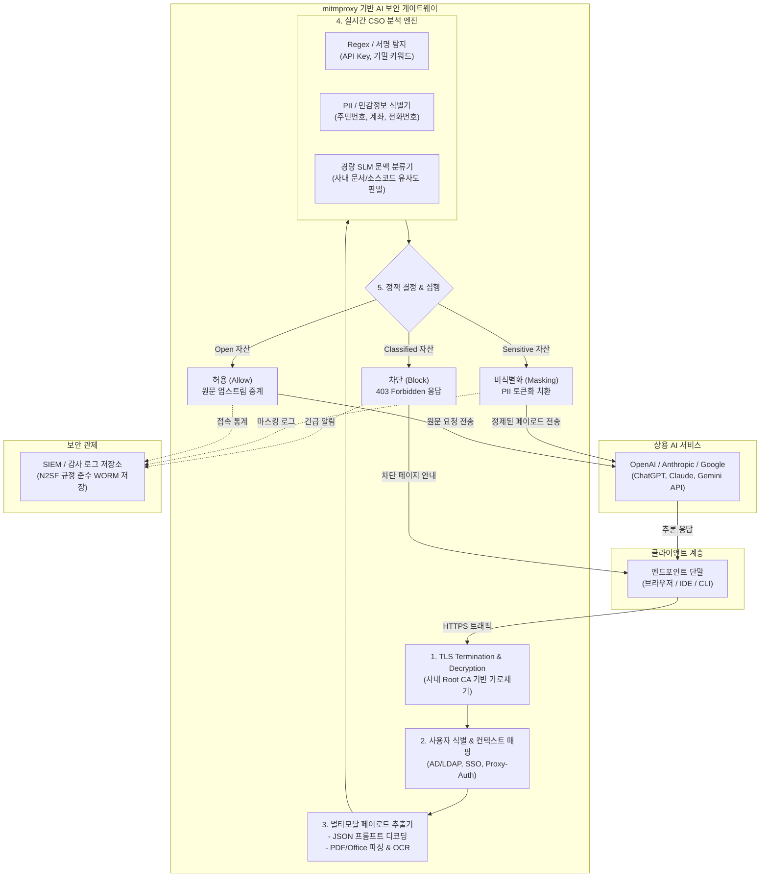

## 1. 개요 및 배경
ChatGPT, Claude, Gemini 등 상용 생성형 AI(GenAI) 서비스의 도입이 가속화되면서 소스코드, 미공개 사업계획, 개인정보, 지적재산권(IP) 유출 위협이 급증했습니다.

본 솔루션은 N2SF(National Network Security Framework, 다층보안체계) 가이드라인의 데이터 보안 및 통제 요건을 충족하기 위해 설계되었습니다. 클라이언트단 에이전트 설치 부담을 최소화하는 mitmproxy 기반 Forward Proxy를 통해 HTTPS 트래픽을 복호화·인터셉트하고, 프롬프트 페이로드 및 멀티모달 첨부파일의 CSO(Classified, Sensitive, Open) 등급을 실시간으로 추론하여 비인가 자산의 외부 전송을 선제 차단(Inline Blocking)합니다.

## 2. N2SF 기반 CSO 데이터 분류 체계
N2SF 가이드라인에 정의된 보안 등급 및 정보 자산 보호 원칙을 기반으로, AI 게이트웨이 파이프라인에서 처리하는 CSO 분류 기준과 처리 정책은 다음과 같습니다.

|등급|정의 및 대상 데이터|통제 정책 (Action)|감사 및 로깅|
|---|---|---|---|
| **C(Classified)** 기밀/핵심자산|• 대외비 및 국가·기관 지정 핵심 자산 • 미공개 소스코드 시스템 내부 아키텍처/자격증명(API Key, Private Key) • 미공개 재무제표, 핵심 기술 연구개발(R&D) 문서|• 즉시 차단 (Block) • HTTP 403 차단 안내 페이지 반환 및 보안 관제(SIEM) 긴급 알림 전송|전문(Full-Payload) 암호화 저장 침해 시도 감사 로그 기록|
| **S(Sensitive)** 민감/준보안정보|• 개인정보보호법상 고유식별정보(주민등록번호 여권번호 등) • 임직원/고객 PII 계좌/카드 결제정보 • 사내 내부 업무 매뉴얼 및 내부 규정 문서|• 동적 마스킹(Masking) 또는 승인 후 차단 해제 • 가명화·토큰화 처리 후 전달하거나 전송 차단|마스킹 메타데이터 및 사용자 식별 정보 감사 로그 기록|
| **O(Open)** 공개 정보|• 외부 공개된 기술 블로그, 언론 보도자료 • 공개 오픈소스 라이브러리 질의, 일반 지식 문의 • 상용 제품 공식 레퍼런스 문서|• 통과 (Allow) • 원문 그대로 대상 AI 서버로 프록시 중계|세션 메타데이터(시간, 사용자, 토큰 사용량) 기본 로깅|

## 3. 솔루션 핵심 아키텍처

## 4. 실시간 트래픽 가로채기 및 분석 처리 흐름
1. TLS 복호화 및 대상 도메인 필터링 (tls_start, requestheaders)
- 클라이언트에서 발생하는 HTTPS 아웃바운드 트래픽을 프록시 내부 Root CA를 통해 복호화합니다.
- 사전에 정의된 상용 AI 엔드포인트(api.openai.com, chatgpt.com, claude.ai, generativelanguage.googleapis.com 등)만 인라인 검사 풀로 라우팅하고, 일반 웹 트래픽은 바이패스(Bypass)하여 프록시 부하를 최소화합니다.

2. 사용자 및 인가 컨텍스트 식별
- 프록시 인증 헤더(Proxy-Authorization), 내부 SSO 토큰(JWT), 또는 클라이언트 고유 식별자(IP/MAC, 802.1x)를 추출합니다.
- 사내 디렉터리(AD/LDAP)와 실시간 매핑하여 요청 주체의 부서, 취급 인가 등급, N2SF 상의 허용 워크로드를 식별합니다.

3. 멀티모달 페이로드 추출 및 파싱
- 텍스트 프롬프트: HTTP Body의 application/json 구조를 역직렬화하여 질의 전문(messages[*].content 등)을 추출합니다.
- 첨부파일: multipart/form-data 스트림을 메모리 버퍼에서 가로채 확장자 및 Magic Byte를 확인합니다. PDF, Word, Excel 문서는 라이브러리를 통해 텍스트로 즉각 변환하며, 이미지 파일은 인라인 OCR 엔진을 호출해 텍스트를 복원합니다.

4. 규칙 및 모델 기반 하이브리드 CSO 등급 판정
- 1단계 (초저지연 서명 검사): 정규식(Regex) 및 해시 테이블을 통해 주민등록번호, 신용카드 번호, AWS/GCP API Key, 사내 지정 대외비 워터마크를 5ms 이내에 탐지합니다.
- 2단계 (문맥 기반 분류): 패턴 매칭으로 식별되지 않는 미공개 소스코드, 사업 전략, 사내 매뉴얼 등은 전진 배치된 경량 언어 모델(SLM) 또는 임베딩 벡터 유사도 엔진을 통해 C/S/O 등급을 산출합니다.

5. 정책 집행 및 피드백 전송
- Classified (기밀): 업스트림 전송을 즉시 중단하고 클라이언트에 403 Forbidden 상태 코드와 함께 N2SF 보안 정책 위반 안내 메시지를 반환하며 SIEM으로 긴급 이벤트를 발행합니다.
- Sensitive (민감): 식별된 민감 식별자를 가명 문자열(예: [PII_USER_ID_1])로 치환한 뒤 업스트림에 전달하거나, 관리자 승인 전까지 요청을 보류합니다.
- Open (공개): 원본 페이로드를 그대로 대상 상용 LLM 서비스에 프록시 중계하고 사용량 로그만 기록합니다.

## 5. 엔터프라이즈 운영 고려사항
지연시간(Latency) 최적화: 프롬프트 인터셉트 파이프라인의 총 추가 지연시간은 50ms 미만으로 유지해야 원활한 실시간 스트리밍(SSE) 체감을 제공합니다. 고중량 파싱(대용량 PDF 문서, 이미지 OCR)은 별도의 비동기 워커 풀로 오프로딩하고, 인라인 검사는 정규식 캐시 및 가벼운 토큰 필터를 전진 배치합니다.

PKI 인증서 배포 및 Pinning 예외: 클라이언트 단말에 사내 전용 사설 Root CA 인증서 배포(GPO/MDM 연동)가 필수적입니다. Certificate Pinning이 강제된 모바일 네이티브 앱이나 일부 개발자 도구의 경우 프록시 차단 대신 기업용 API 엔드포인트로 유도하는 네트워크 라우팅 정책을 병행합니다.

규제 감사 대응: 모든 차단/수정 내역은 N2SF 컴플라이언스 기준에 맞춰 변조 방지(WORM) 감사 로그 저장소에 기록하고, 주기적으로 오탐/미탐률을 모니터링하여 분류 엔진의 정확도를 보정합니다.

## 6. 참고
mitmproxy (https://www.mitmproxy.org/)