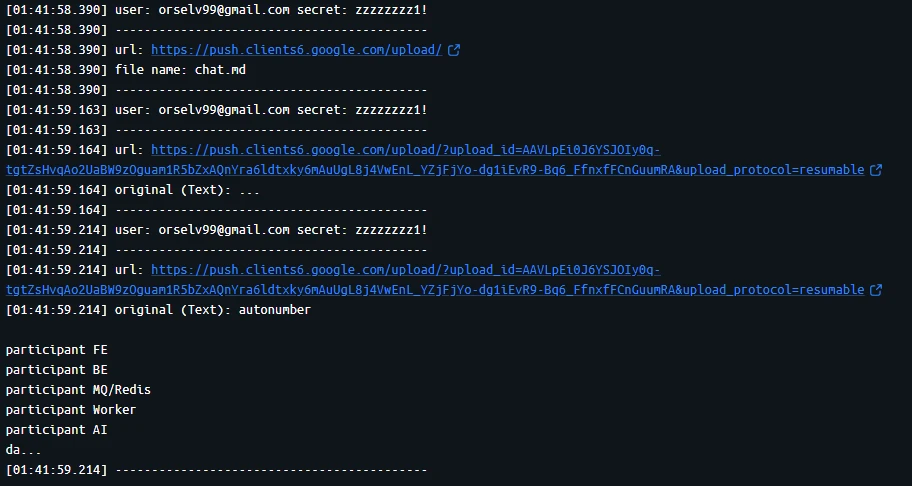
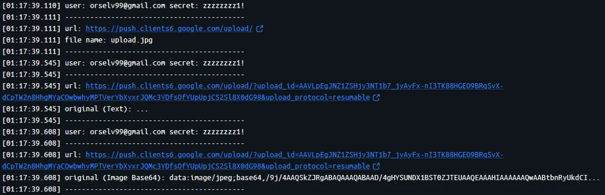
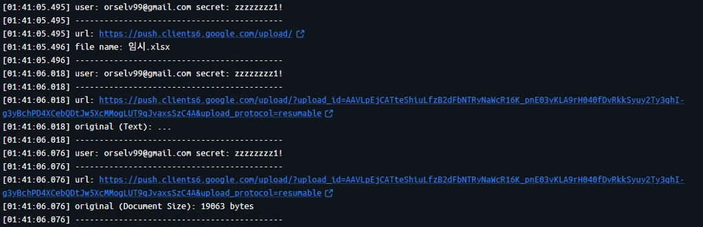
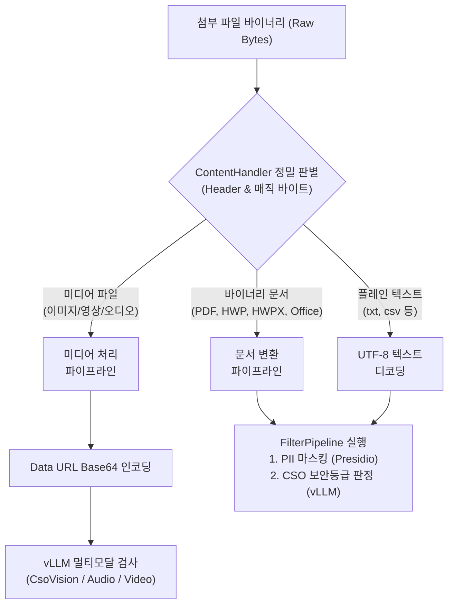

## 프록시 기반 AI 감사의 첫걸음: 패킷 분석

외부 생성형 AI 게이트웨이를 구축할 때 핵심은 <span style="color: var(--color-accent-spec);">"사용자가 질문을 던지거나 문서를 첨부할 때, 실제로 어떤 형태의 HTTP 요청을 만들어 서버로 쏘는가?"</span> 를 파악하는 것이었다.

상용 서비스들은 단일 규격을 쓰지 않았다. 서비스마다 사용하는 URL 엔드포인트가 다르고, 프롬프트 페이로드를 담는 방식(중첩 JSON, 폼 인코딩)과 <span style="color: var(--color-accent-spec);">첨부파일을 업로드하는 파이프라인</span>이 제각각이었다.

브라우저 개발자모드 네트워크와 mitmproxy 를 활용해 패킷을 스니핑하며 분석해 낸 `Google Gemini`, `OpenAI ChatGPT`, `Anthropic Claude` 의 요청 구조와 트러블슈팅 포인트를 정리했다.
<br/>
<br/>

## 서비스별 요청/첨부 구조 비교

| 항목 | Google Gemini | OpenAI ChatGPT | Anthropic Claude |
| :--- | :--- | :--- | :--- |
|프롬프트 URL|• gemini.google.com<br/>• /***/StreamGenerate|• chatgpt.com<br/>• /backend-api/f/conversation<br/>• /backend-anon/f/conversation|• claude.ai/api/organizations<br/>• /{org}/.../completion|
|프롬프트 포맷|Form Body<br/>`f.req` 내**2중 중첩 JSON** 문자열|JSON Body<br/>(`messages[0].content.parts[0]`)|JSON Body<br/>(prompt 필드)|
|첨부 파일명 URL|push.clients*.google.com/upload |/backend-api/files|/upload-file (원문과 동시 전달)|
|첨부 원문 URL|upload/?upload_id=...|*.oaiusercontent.com (Azure Blob)|-|
|파일-원문 매핑|응답 헤더<br/>`x-goog-upload-control-url` 매핑|파일명 요청 응답 바디<br/>`upload_url` 매핑 |매핑 불필요<br/> (단일 Multipart 요청)|





<br/>
<br/>

## 서비스별 상세 프로토콜 분석

### 1. Google Gemini: 2중 중첩 JSON과 분할 업로드 매핑

Gemini 는 Parsing 난이도가 가장 높은 편이었다. 

- 프롬프트
    - 엔드포인트
        - `gemini.google.com/***/StreamGenerate`
    - 데이터 구조
        - 본문이 `application/x-www-form-urlencoded` 로 오며, `f.req` 키 안에 JSON 문자열이 담겨 있다
        - 그런데 이 JSON 배열의 두 번째 인덱스에 <span style="color: var(--color-accent-spec);">또 다른 JSON 문자열이 중첩 직렬화</span>
    - 파싱 로직
```python
parsed = urllib.parse.parse_qsl(body)

for key, value in parsed:
    f_req_list  = json.loads(value)             # 1차 파싱
    nested_list = json.loads(f_req_list[1])     # 2차 파싱
    user_prompt = nested_list[0][0]             # 실제 사용자 입력 텍스트 추출
```

- 파일 첨부 
    - 2-Step 비동기 업로드
    - 1단계 (메타데이터)
        - `push.clients*.google.com/upload`
        - body 에 `File name: <파일명>` 형태로 전달
        - 업로드 허용 시 서버는 응답 헤더에 세션 키인 `x-goog-upload-control-url` 을 반환
    - 2단계 (바이너리 본문)
        - `push.clients*.google.com/upload/?upload_id=...`
        - 이 요청에는 파일명이 없고 순수 바이너리/미디어 본문만 전달
        - 1단계 응답에서 캡처해 둔 `x-goog-upload-control-url` 을 key 로 삼아, `map` 에서 원본 파일명을 찾아내야 변환 및 검사
    - 업로드가 실패 또는 차단되면 백그라운드에서 동일 URL 로 <span style="color: var(--color-accent-spec);">최대 7회 재시도</span>한다. 이를 방어하기 위해 실패한 upload_id URL 을 캐싱하여 재시도 요청을 처리
<br/>
<br/>

### 2. OpenAI ChatGPT: Azure Blob 저장소와의 비동기 매핑
ChatGPT 는 메타데이터 생성과 실제 스토리지 업로드가 명확히 분리되어 있다.

- 프롬프트 추출
    - 엔드포인트
        - `chatgpt.com/backend-api/f/conversation` (로그인) 
        - `chatgpt.com/backend-anon/f/conversation` (익명)
    - 데이터 구조
        - 표준 JSON 이며 `messages[0]["content"]["parts"][0]` 에서 텍스트를 추출
        - 첨부파일만 전송된 경우 해당 필드가 비어있으므로 예외 처리가 필요
- 파일 첨부
    - 1단계 (파일 등록)
        - `chatgpt.com/backend-api/files`
        - body 에 `{"file_name": "...", "file_size": ...}` 형태로 전달
        - 응답 JSON 에 클라우드 업로드 주소인 `upload_url`
        - 프록시는 응답 헤더에 `커스텀 헤더(x-acl-ai-upload: filename)`를 달아두고, 응답 hook 에서 upload_url -> filename 맵핑을 생성
    - 2단계 (원문 업로드)
        - `*.oaiusercontent.com/...`
        - Azure Blob 저장소로 바이너리가 직접 전송
        - 저장해 둔 `upload_url`과 일치하는지 확인하여 파일명을 역추적하고 본문 검사를 진행
<br/>
<br/>

### 3. Anthropic Claude: 단일 Multipart 파싱과 CRLF 보존 문제
Claude는 프롬프트와 파일 업로드가 비교적 직관적이지만, 바이너리 처리에서 프록시 엔진의 저수준 함정이 존재한다.

- 프롬프트 추출
    - 엔드포인트
        - `claude.ai/api/organizations/{org_id}/.../completion or completion2`
    - 특이점
        - 텍스트 프롬프트는 prompt 필드에 들어오지만, <span style="color: var(--color-accent-spec);">.txt 파일 첨부의 경우 `attachments[].extracted_content` 에 내용이 담겨</span> 들어오므로 두 영역을 모두 검사
- 파일 첨부
    - 엔드포인트
        - `claude.ai/api/organizations/{org_id}/conversations/{conv_id}/wiggle/upload-file`
    - 파일명과 파일 바이너리가 `multipart/form-data` 요청 하나에 모두 포함
    - CRLF 유실로 인한 바이너리 손상
        - mitmproxy 의 기본 `flow.request.multipart_form 헬퍼` 는 내부적으로 파트 내용을 줄 단위로 파싱하고 재조합
        - 이 과정에서 이미지나 문서 바이너리 내부의 개행 바이트(\r\n)가 손상되어 이미지가 깨지거나 OCR/변환 엔진이 422 오류발생
        - 이를 해결하기 위해 Raw 바이트를 Boundary 기준으로 직접 쪼개 바이너리 무결성을 유지
<br/>
<br/>

### 4. 미인증 사용자 처리와 브라우저별 리다이렉트
보안 게이트웨이 환경에서는 다음 AI 서비스 접근을 통제한다. 단순 API 호출이 아닌 브라우저 내 실제 페이지 진입 `Sec-Fetch-Dest: document` 시점을 포착한다. 

인증 토큰 (x-acl-ai-auth)
- 권한이 없는 사용자 -> 관리자에게 문의
- 없거나 만료된 사용자 -> 로그인 페이지로 리다이렉트
    - 사용자 브라우저의 `User-Agent` 를 확인하여 각 브라우저에 맞는 확장 프로그램 대시보드로 `302 Found` 리다이렉트

|브라우저|리다이렉트 url|
|---|---|
|Chrome|<span style="color: var(--color-accent-impl);">chrome-extension</span>://{id}/tabs/dashboard.html?target={url}|
|Edge|<span style="color: var(--color-accent-impl);">extension</span>://{id}/tabs/dashboard.html?target={url}|
|Whale|<span style="color: var(--color-accent-impl);">whale-extension</span>://{id}/tabs/dashboard.html?target={url}|
|Firefox|<span style="color: var(--color-accent-impl);">moz-extension</span>://{id}/tabs/dashboard.html?target={url}|

<br/>
<br/>

### 5. 미디어 및 첨부 문서 처리 파이프라인
업로드되는 파일은 요청 헤더의 `Content-Type` 뿐만 아니라, 매직 바이트(Magic Number) 시그니처 검사를 거쳐 미디어, 바이너리 문서, Plain Text 로 분류되어 처리했다.

바이너리 문서 역시 Parser 를 거쳐 Plain Text 로 추출한 뒤, 일반 텍스트와 동일한 FilterPipeline 검증 경로를 밟게 된다. 



- 매직 바이트 기반 미디어/문서 정밀 식별
    - 웹 서비스 요청 헤더의 `Content-Type` 은 불완전하거나 누락되는 경우가 많다. 따라서 바이너리 앞단의 시그니처를 검사하여 파일의 실제 타입을 확인했다.
    - 미디어 파일
        - 이미지
            - `PNG(\x89PNG)`
            - `JPEG(\xff\xd8)`
            - `WebP(RIFF...WEBP)` 
            - `GIF(GIF87a/GIF89a)`
            - `BMP(BM)`
        - 비디오
            - `MP4(ftyp)`
            - `WebM(\x1a\x45\xdf\xa3)`
            - `AVI(RIFF...AVI )`
        - 오디오
            - `WAV(RIFF...WAVE)`
            - `MP3(ID3 또는 \xff\xfb 등 프레임 헤더)`
    - 문서 파일
        - PDF
            - `%PDF 시그니처`
        - OLE2 포맷
            - `\xd0\xcf\x11\xe0` 시그니처 확인 후, <span style="color: var(--color-accent-impl);">상위 2KB 헤더</span>에서 
            - `WordDocument(DOC)`
            - `PowerPoint Document(PPT)`
            - `Workbook/Excel(XLS)`
            - `Hwp Document File(HWP)`
        - ZIP/OpenXML 포맷
            - `PK\x03\x04` 시그니처 확인 후, <span style="color: var(--color-accent-impl);">상위 4KB 내부 메타데이터</span>에서 
            - `DOCX`
            - `PPTX`
            - `XLSX`
            - `HWPX`
- 바이너리 문서의 텍스트 추출 및 NULL 바이트 정제
    - PDF 나 일반 오피스 문서는 [MarkItDown](https://github.com/microsoft/markitdown) Stream Parser 를 통해 텍스트로 추출
    - HWP / HWPX 전용 파싱
        - 라이브러리 호환성 문제가 있는 HWP는 임시 파일 생성 후 `MarkItDown` 으로 변환하며, HWPX 는 [Hwpx-parser](https://github.com/KimDaehyeon6873/hwp-hwpx-parser) 를 사용하여 추출
    - NULL 바이트(\x00) 제거
        - 바이너리 파싱 중 불완전한 바이트가 섞이면 PostgreSQL의 text/jsonb 컬럼에 로그를 저장할 때 DB 500 에러가 발생하므로, 변환된 텍스트는 `\x00`을 제거
- 멀티모달 비전 모델 픽셀 상한 제어 (_VISION_MAX_PIXELS = 12,845,056)
    - Claude 등 원본 이미지를 고해상도 그대로 업로드하는 서비스의 경우, 백엔드 vLLM 멀티모달 모델(gemma4) 이 422 VALIDATION_ERROR 를 뱉는다
    - 전체 픽셀 수가 한도를 넘으면 가로세로 비율을 유지한 채 다운 스케일링한 사본으로 검사를 수행하고, 감사 로그용 Base64 에는 사용자 원본을 저장
<br/>
<br/>
